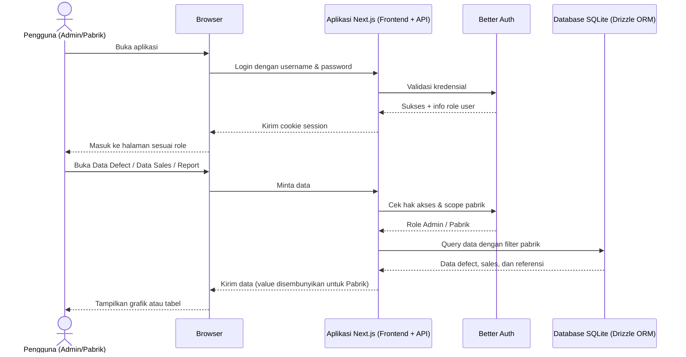
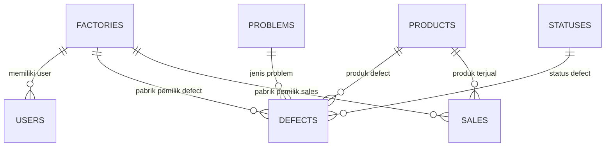

# PRD — Project Requirements Document

## 1. Overview

Aplikasi **Web Analisa Defect dan Sales Produk** dibuat untuk menggantikan pencatatan manual berbasis Google Spreadsheet yang selama ini dipakai oleh staff pabrik. Data defect dan sales yang tersebar di banyak spreadsheet membuat proses rekap lambat, rawan salah, dan sulit melihat tren per produk maupun per pabrik.

Tujuan utama aplikasi ini adalah:

- Menyimpan seluruh data **defect** dan **sales** di satu tempat yang rapi dan terpusat.
- Membantu pengguna membuat **laporan otomatis** harian, mingguan, bulanan, atau rentang tanggal tertentu.
- Menampilkan perbandingan antara defect dan sales dalam bentuk **grafik dan tabel rekap per produk**.
- Mengatur hak akses antara **Admin** dan **Pabrik**, termasuk pembatasan data per pabrik dan penyembunyian nilai/value.
- Mendukung **impor dan ekspor Excel** agar perpindahan data dari spreadsheet lama tetap mudah.

Keberhasilan awal aplikasi ini diukur dari kebiasaan pengguna dalam mengisi **Data Defect** dan **Data Sales**, sehingga laporan bisa tersaji otomatis tanpa rekap manual.

---

## 2. Requirements

### 2.1 Target Pengguna

- Pengguna awal adalah **staff pabrik** yang sebelumnya mencatat data di Google Spreadsheet.
- Terdapat dua peran pengguna: **Admin** dan **Pabrik**.

### 2.2 Kebutuhan Utama

- Aplikasi berbasis web dan bisa diakses melalui browser.
- Semua modul CRUD bisa **impor dan ekspor dari/ke Excel**.
- Mata uang yang dipakai adalah **IDR (Rupiah)**.
- Data yang dipilih pada form harus konsisten, misalnya pilihan Produk, Problem, Status, dan Factory berasal dari daftar master yang bisa dikelola.

### 2.3 Menu Utama

1. **Report** — laporan analisis defect dan sales.
2. **Data Sales** — kelola data penjualan.
3. **Data Defect** — kelola data produk cacat.
4. **User Management** — kelola user dan daftar pabrik.

### 2.4 Hak Akses

- **Admin**
  - Bisa mengakses semua halaman.
  - Bisa membaca, menambah, mengubah, dan menghapus data.
  - Bisa melihat seluruh pabrik dan seluruh nilai/value.

- **Pabrik**
  - Hanya bisa melihat data pabriknya sendiri.
  - Tidak bisa membuka User Management.
  - Hanya bisa membaca, tidak bisa menambah/mengubah/menghapus data.
  - Tidak bisa melihat kolom Value/Nilai, hanya bisa melihat Quantity.

### 2.5 Aturan Deteksi Data Ganda Saat Impor Excel

Saat import data dari Excel, sistem akan otomatis melewati/skip data yang sudah ada dan hanya memasukkan data baru.

Aturan deteksi data ganda pada masing-masing modul:

| Modul | Data dianggap sama jika |
|---|---|
| Defect | `Code Garansi` sudah ada di database |
| Sales | Kombinasi `Produk + Pabrik + Bulan` sudah ada di database |
| Produk / Problem / Status / Factory | `Nama` sudah ada di database |
| User | `Username` sudah ada di database |

---

## 3. Core Features

### Fase 1 — Laporan Analisis

- **Laporan Analisis**
  - Menampilkan perbandingan defect dan sales dalam bentuk grafik serta tabel per produk.
  - Tersedia pada menu **Report**.

- **Pilih Periode**
  - Pengaturan laporan harian (*daily*), mingguan (*weekly*), bulanan (*monthly*), atau rentang tanggal sendiri.
  - Untuk data sales yang hanya memiliki bulan (contoh `Jan`), sales ikut tampil berdasarkan bulan yang tercakup dalam periode laporan.

- **Grafik Total Defect & Sales**
  - Menampilkan grafik total defect dan sales agar tren pada periode terlihat.
  - Grafik dibedakan berdasarkan quantity serta value (value hanya untuk Admin).

- **Tabel Rekap Per Produk**
  - Menampilkan setiap produk beserta:
    - Total quantity defect
    - Total value defect (IDR)
    - Total quantity sales
    - Total value sales (IDR)
    - Rasio defect terhadap sales

- **Saring Laporan**
  - Laporan bisa disaring berdasarkan pabrik dan periode.
  - Admin bisa memilih semua pabrik; role Pabrik otomatis hanya melihat pabriknya sendiri.

### Fase 2 — Data Sales dan Data Defect

#### Data Sales

- **Ringkasan Total Sales**
  - Bagian atas halaman menampilkan total quantity sales dan total value sales dalam Rupiah.
  - Role Pabrik hanya melihat total quantity, tanpa value.

- **Tambah/Ubah/Hapus Sales**
  - Mencatat penjualan baru: Produk, Factory, Bulan, Quantity, dan Value.
  - Mengubah data yang keliru dan menghapus data yang tidak diperlukan.

- **Filter & Cari Sales**
  - Menyaring daftar sales berdasarkan produk, pabrik, atau bulan.

- **Impor/Ekspor Excel**
  - Impor data sales dari Excel; data ganda otomatis dilewati.
  - Ekspor data sales yang sedang tampil ke Excel.

#### Data Defect

- **Ringkasan Total Defect**
  - Bagian atas halaman menampilkan total quantity defect dan total value defect dalam Rupiah.
  - Role Pabrik hanya melihat total quantity, tanpa value.

- **Tambah/Ubah/Hapus Defect**
  - Mencatat defect baru dengan data:
    - Code Garansi
    - Timestamp
    - Link foto dan video
    - Problem
    - Problem Detail
    - Produk
    - Quantity
    - Status
    - Factory
    - Value

- **Filter & Cari Defect**
  - Menyaring data defect berdasarkan periode, produk, status, problem, atau pabrik.

- **Impor/Ekspor Excel**
  - Impor data defect dari Excel; data dengan Code Garansi yang sama otomatis dilewati.
  - Ekspor data defect yang sedang tampil ke Excel.

### Fase 3 — Data Master & User Management

- **Data Master**
  - **Kelola Produk** — daftar produk untuk sales dan defect.
  - **Kelola Problem** — daftar masalah yang bisa dipilih saat mencatat defect.
  - **Kelola Status** — daftar status defect.
  - Setiap daftar master bisa ditambah, diubah, dihapus, serta diimpor/diekspor ke Excel.

- **Manajemen Pengguna**
  - **Kelola Akun User** — menambah, mengubah, dan menghapus user dengan data:
    - Username
    - Password (disimpan dalam bentuk terenkripsi/hash)
    - Factory
    - Status Admin atau bukan
  - **Kelola Daftar Pabrik** — menambah, mengubah, dan menghapus pabrik.
  - **Atur Peran & Hak Akses** — menentukan user sebagai Admin atau Pabrik beserta batasan menu yang boleh diakses.

### Fase 4 — Login & Hak Akses

- **Login dan Logout**
  - Pengguna masuk memakai username dan password.
  - Halaman yang muncul disesuaikan dengan peran masing-masing.

- **Menu Sesuai Peran**
  - Admin melihat semua menu.
  - Role Pabrik tidak melihat menu User Management dan hanya bisa membaca data.

- **Batasi Data Pabrik**
  - Role Pabrik hanya melihat data defect dan sales milik pabriknya sendiri.

- **Sembunyikan Nilai**
  - Role Pabrik tidak bisa melihat value defect maupun value sales; kolom value disembunyikan di seluruh halaman.

### Fase 5 — Impor & Ekspor Excel

- **Unduh Template Format**
  - Pengguna bisa mengunduh file Excel kosong sesuai modul agar pengisian data massal lebih mudah.

- **Impor Data Excel**
  - Pengguna mengunggah file Excel berisi data.
  - Sistem mendeteksi data yang sudah ada, kemudian melewati/skip data ganda.
  - Hanya data baru yang ditambahkan ke database.

- **Ekspor Data ke Excel**
  - Data yang sedang ditampilkan di halaman CRUD bisa diunduh menjadi file Excel.
  - Untuk role Pabrik, kolom value tidak ikut diekspor.

---

## 4. User Flow

### 4.1 Admin — Setup Awal

1. Admin login ke aplikasi.
2. Membuka **User Management**.
3. Menambahkan daftar **Factory** terlebih dahulu.
4. Membuat akun user:
   - User Admin tanpa factory.
   - User Pabrik yang terhubung ke salah satu factory.
5. Membuka menu Data Master untuk mengatur daftar **Produk**, **Problem**, dan **Status**.
6. Aplikasi siap digunakan oleh semua user.

### 4.2 Pencatatan Data Sales dan Defect oleh Admin

1. Admin membuka halaman **Data Sales**.
2. Klik tombol **Tambah** untuk mengisi penjualan baru, atau klik **Import Excel** untuk input massal.
3. Data tersimpan dan muncul di tabel beserta total quantity dan value di bagian atas.
4. Admin juga membuka halaman **Data Defect**.
5. Klik **Tambah Data Defect**, lalu mengisi form lengkap termasuk problem, produk, status, factory, link foto/video, dan value.
6. Jika ada data lama dari spreadsheet, Admin memakai menu impor Excel agar data masuk lebih cepat.

### 4.3 Penggunaan oleh Role Pabrik

1. User pabrik login dengan username dan password.
2. Sistem memeriksa factory milik user tersebut.
3. User pabrik hanya melihat menu **Report**, **Data Sales**, dan **Data Defect**.
4. Seluruh tombol tambah, ubah, hapus, dan import disembunyikan/dinonaktifkan.
5. Kolom value tidak muncul; user pabrik hanya melihat quantity.
6. Data yang tampil hanya milik factory-nya sendiri.

### 4.4 Melihat Laporan Analisis

1. Pengguna membuka halaman **Report**.
2. Memilih periode:
   - Harian
   - Mingguan
   - Bulanan
   - Rentang tanggal manual
3. Admin dapat memilih pabrik tertentu; role Pabrik terkunci pada pabriknya sendiri.
4. Sistem menampilkan:
   - Grafik total defect dan sales.
   - Tabel rekap per produk berisi quantity, value, dan rasio defect terhadap sales.
5. Pengguna bisa mengunduh laporan atau data tabel ke Excel jika diperlukan.

### 4.5 Impor dan Ekspor Data

1. Pengguna membuka halaman CRUD yang diinginkan.
2. Untuk ekspor, klik **Ekspor Excel**; file Excel berisi data yang sedang tampil terunduh.
3. Untuk impor:
   - Klik **Unduh Template** bila perlu.
   - Isi file Excel sesuai format.
   - Upload file melalui tombol **Import Excel**.
   - Sistem memeriksa data ganda, melewati data yang sudah ada, lalu memasukkan data baru.
   - Sistem memberi ringkasan hasil impor, misalnya jumlah data berhasil masuk dan jumlah data yang dilewati.

---

## 5. Architecture

Aplikasi dibangun sebagai aplikasi web full-stack dengan satu codebase utama:

- **Frontend** menangani tampilan, grafik, form, dan tabel.
- **Backend/API** menangani autentikasi, validasi hak akses, query database, hingga proses impor/ekspor Excel.
- **Database** menyimpan seluruh data user, factory, produk, defect, sales, dan data referensi.
- **Session login** memastikan setiap user hanya melihat data sesuai perannya.

Alur arsitektur utama digambarkan sebagai berikut:

Setiap permintaan data akan diperiksa hak aksesnya:

- Jika user adalah **Admin**, data bisa mencakup semua factory dan semua value.
- Jika user adalah **Pabrik**, sistem otomatis menambahkan filter `factory_id` milik user tersebut dan menghapus kolom value dari respons.

---

## 6. Database Schema

Struktur database disusun agar data defect dan sales tetap mengikuti kolom yang sudah dipakai user sebelumnya.

### Tabel `factories`

| Kolom | Tipe | Kegunaan |
|---|---|---|
| `id` | Integer / Primary Key | ID pabrik |
| `name` | Text / Unique | Nama pabrik |
| `created_at` | Timestamp | Waktu data dibuat |

### Tabel `users`

| Kolom | Tipe | Kegunaan |
|---|---|---|
| `id` | Integer / Primary Key | ID user |
| `username` | Text / Unique | Username untuk login |
| `password_hash` | Text | Password yang sudah di-hash |
| `factory_id` | Integer / Foreign Key | Factory milik user; kosong jika Admin |
| `is_admin` | Boolean | Penanda user adalah Admin atau bukan |
| `created_at` / `updated_at` | Timestamp | Waktu data dibuat / diubah |

### Tabel `products`

| Kolom | Tipe | Kegunaan |
|---|---|---|
| `id` | Integer / Primary Key | ID produk |
| `name` | Text / Unique | Nama produk |
| `created_at` | Timestamp | Waktu data dibuat |

### Tabel `problems`

| Kolom | Tipe | Kegunaan |
|---|---|---|
| `id` | Integer / Primary Key | ID problem |
| `name` | Text / Unique | Nama masalah / problem defect |
| `created_at` | Timestamp | Waktu data dibuat |

### Tabel `statuses`

| Kolom | Tipe | Kegunaan |
|---|---|---|
| `id` | Integer / Primary Key | ID status |
| `name` | Text / Unique | Nama status defect |
| `created_at` | Timestamp | Waktu data dibuat |

### Tabel `defects`

| Kolom | Tipe | Kegunaan |
|---|---|---|
| `id` | Integer / Primary Key | ID data defect |
| `code_garansi` | Text / Unique | Kode garansi produk defect |
| `time_stamp` | Datetime | Waktu kejadian defect |
| `photos_link` | Text | Link foto defect |
| `videos_link` | Text | Link video defect |
| `problem_id` | Integer / Foreign Key | Jenis problem |
| `problem_detail` | Text | Penjelasan detail problem |
| `product_id` | Integer / Foreign Key | Produk yang defect |
| `quantity` | Integer | Jumlah produk defect |
| `status_id` | Integer / Foreign Key | Status defect |
| `factory_id` | Integer / Foreign Key | Pabrik asal defect |
| `value` | Numeric | Nilai kerugian dalam IDR |
| `created_at` / `updated_at` | Timestamp | Waktu data dibuat / diubah |

### Tabel `sales`

| Kolom | Tipe | Kegunaan |
|---|---|---|
| `id` | Integer / Primary Key | ID data sales |
| `product_id` | Integer / Foreign Key | Produk yang terjual |
| `factory_id` | Integer / Foreign Key | Pabrik yang menjual |
| `month` | Text | Bulan dalam 3 huruf, contoh: `Jan` |
| `quantity` | Integer | Jumlah produk terjual |
| `value` | Numeric | Nilai penjualan dalam IDR |
| `created_at` / `updated_at` | Timestamp | Waktu data dibuat / diubah |

Untuk mencegah duplikat saat impor Excel:

- `defects` memiliki `code_garansi` unik.
- `sales` memiliki kombinasi unik `product_id + factory_id + month`.
- `products`, `problems`, `statuses`, dan `factories` memiliki `name` unik.

### Diagram Relasi Database

Catatan kecil: untuk user Admin, kolom `factory_id` pada tabel `users` dikosongkan karena Admin tidak terikat pada satu pabrik.

---

## 7. Tech Stack

Karena pilihan teknologi belum ditentukan sebelumnya, berikut rekomendasi default yang sesuai kebutuhan aplikasi:

- **Frontend:** Next.js (App Router) + Tailwind CSS + shadcn/ui.
- **Grafik & Visualisasi:** Recharts, untuk menampilkan grafik total defect dan sales pada halaman Report.
- **Backend/API:** Next.js Route Handlers / Server Actions yang menyatu dengan frontend.
- **Autentikasi & Hak Akses:** Better Auth, menangani login username/password, session, dan perlindungan halaman berdasarkan role.
- **Database:** SQLite.
- **ORM:** Drizzle ORM, dipakai untuk mengelola tabel dan query database dengan aman.
- **Import & Ekspor Excel:** SheetJS (xlsx), untuk membaca dan membuat file Excel.
- **Format Mata Uang:** `Intl.NumberFormat` dengan locale `id-ID` dan mata uang `IDR`.
- **Deployment:** Vercel atau platform Node.js lainnya. Jika memakai SQLite pada hosting serverless, file database bisa dihosting menggunakan Turso/LibSQL agar tetap bisa diakses oleh banyak pengguna.
- **Penyimpanan Foto/Video:** tidak memerlukan upload karena data hanya menyimpan tautan/link, sehingga media tetap disimpan di tempat asal dan cukup ditampilkan lewat link tersebut.

Dengan stack ini, aplikasi cukup ringan untuk dipakai internal oleh Admin dan beberapa user pabrik, tetapi tetap mudah dikembangkan jika jumlah data dan pengguna meningkat.