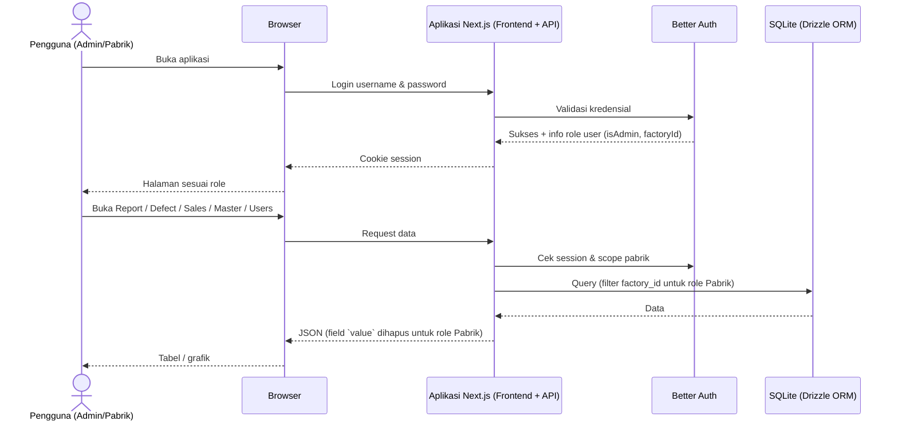
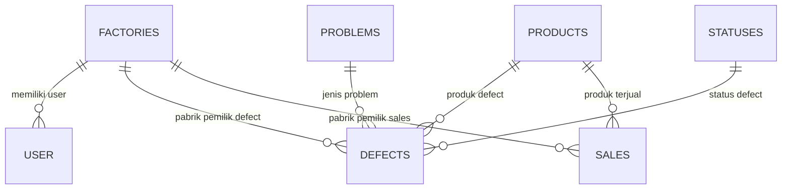

# BARDI Defect Report — Web Analisa Defect & Sales Produk

> **Dokumen ini adalah PRD lengkap + dokumentasi implementasi terkini (single source of truth).**
> Cocok dipakai sebagai konteks awal untuk sesi baru (AI agent / harness lain).
> `PRD.md` adalah dokumen kebutuhan awal; README ini adalah versi terupdate yang sudah disinkronkan dengan implementasi.

- **Repo**: https://github.com/riswannh/BARDI-Defect-Report (private, branch `main`)
- **Status**: semua fase PRD selesai diimplementasikan + revisi lanjutan (i18n, bulk action, delete-all dengan backup, searchable dropdown, redesign brand, Docker) + revisi alur input defect & navigasi mobile

---

## Daftar Isi

1. [Ringkasan Produk](#1-ringkasan-produk)
2. [Status Implementasi](#2-status-implementasi)
3. [Tech Stack](#3-tech-stack)
4. [Arsitektur](#4-arsitektur)
5. [Struktur Folder](#5-struktur-folder)
6. [Database Schema](#6-database-schema)
7. [API Reference](#7-api-reference)
8. [Fitur & Aturan Bisnis per Modul](#8-fitur--aturan-bisnis-per-modul)
9. [Ringkasan Aturan Bisnis Penting](#9-ringkasan-aturan-bisnis-penting)
10. [Hak Akses](#10-hak-akses)
11. [Setup & Menjalankan](#11-setup--menjalankan)
12. [Environment Variables](#12-environment-variables)
13. [Kredensial & Data Seed](#13-kredensial--data-seed)
14. [Workflow Git (WAJIB)](#14-workflow-git-wajib)
15. [Catatan Teknis & Gotcha](#15-catatan-teknis--gotcha)
16. [User Flow](#16-user-flow)

---

## 1. Ringkasan Produk

Aplikasi **Web Analisa Defect dan Sales Produk** dibuat untuk menggantikan pencatatan manual berbasis Google Spreadsheet yang selama ini dipakai staff pabrik. Data defect dan sales yang tersebar di banyak spreadsheet membuat rekap lambat, rawan salah, dan sulit melihat tren per produk maupun per pabrik.

Tujuan utama:

- Menyimpan seluruh data **defect** dan **sales** di satu tempat yang rapi dan terpusat.
- Membantu pengguna membuat **laporan otomatis** harian, mingguan, bulanan, tahunan, atau rentang tanggal tertentu.
- Menampilkan perbandingan defect vs sales dalam bentuk **grafik dan tabel rekap per produk**.
- Mengatur hak akses **Admin** dan **Pabrik** (pembatasan data per pabrik + penyembunyian nilai/value).
- Mendukung **impor dan ekspor Excel** agar perpindahan data dari spreadsheet lama mudah.

Keberhasilan diukur dari kebiasaan pengguna mengisi **Data Defect** dan **Data Sales**, sehingga laporan tersaji otomatis tanpa rekap manual.

### Target Pengguna

- **Admin** — mengelola semua data, master, user, dan melihat seluruh pabrik/nilai.
- **Pabrik** — hanya melihat laporan data pabriknya sendiri, tanpa nilai/value, dan hanya menu Report.

---

## 2. Status Implementasi

| Fase | Nama | Status |
|---|---|---|
| 1 | Laporan Analisis (Report) | ✅ Selesai + revisi (chart defect-only, pie, yearly sales, popup detail, paging) |
| 2 | Data Sales & Data Defect (CRUD + filter + Excel) | ✅ Selesai + revisi (bulk action, periode, pencarian) |
| 3 | Data Master & User Management | ✅ Selesai + paging |
| 4 | Login & Hak Akses | ✅ Selesai (Better Auth, role guard, scoping pabrik, value disembunyikan) |
| 5 | Impor & Ekspor Excel | ✅ Selesai + tracing error/skip, template, backup sebelum delete-all |
| + | i18n (Indonesia/English/中文) | ✅ Selesai |
| + | Docker & deployment lokal | ✅ Selesai (healthcheck, bind mount data) |
| + | Searchable dropdown (semua select) | ✅ Selesai (autofocus + reset saat ditutup) |
| + | Hapus semua data dengan backup otomatis | ✅ Selesai |
| + | Bulk edit / bulk delete (Defect & Sales) | ✅ Selesai |
| + | Alur input defect cepat (timestamp otomatis, simpan & tambah lagi, saran kode garansi, autofocus, konfirmasi buang isian) | ✅ Selesai |
| + | Navigasi mobile (sidebar jadi sheet di < lg) — semua halaman bebas overflow di 390px | ✅ Selesai |
| + | Perbaikan bug Select: nilai terpilih tidak lagi direset `null` saat popup ditutup | ✅ Selesai |

---

## 3. Tech Stack

| Bagian | Teknologi | Versi (package.json) |
|---|---|---|
| Framework | Next.js (App Router) | 16.3.4 |
| UI | React | 19.2.8 |
| Styling | Tailwind CSS v4 + tw-animate-css | ^4 |
| Komponen | shadcn/ui v4 berbasis **Base UI** (`@base-ui/react`) | ^1.8.0 |
| Ikon | lucide-react | ^1.43.0 |
| Grafik | Recharts | ^3.10.1 |
| Notifikasi | sonner | ^2.0.8 |
| Tema | next-themes | ^0.4.6 |
| Auth | Better Auth (username plugin) | ^1.7.4 |
| ORM | Drizzle ORM | ^0.45.2 |
| Database | SQLite (better-sqlite3) | ^12.11.1 |
| Excel | SheetJS (xlsx) | ^0.18.5 |
| Validasi | zod | ^4.6.1 |
| Bahasa | TypeScript | ^5 |
| Runtime script | tsx | ^4.23.13 |
| Deployment | Docker (node:22-bookworm-slim), docker compose | — |

Catatan penting: `@swc/helpers` **wajib** terpasang sebagai devDependency (tanpa ini dev server error "Panic in async function").

---

## 4. Arsitektur

Aplikasi web full-stack satu codebase (Next.js App Router):

- **Frontend** — tampilan, grafik, form, tabel (React Server/Client Components).
- **Backend/API** — Next.js Route Handlers: autentikasi, guard role, validasi zod, query Drizzle, impor/ekspor Excel.
- **Database** — SQLite (file), diakses via Drizzle + better-sqlite3.
- **Session** — cookie Better Auth; setiap request diperiksa role & scope pabrik.



Aturan server-side:

- **Admin** — akses semua data, semua pabrik, semua nilai.
- **Pabrik** — `scopedFactoryId()` otomatis mengunci `factoryId` user; field `value` dihapus dari respons oleh helper `stripValue()` (`src/lib/api/records.ts`, dipakai juga di `report.ts`).

---

## 5. Struktur Folder

```
Open Code Project/
├── PRD.md                  # PRD awal (dokumen ini = versi terupdate)
├── README.md               # ← dokumen ini (PRD + dokumentasi implementasi)
├── AGENTS.md               # aturan workflow untuk AI agent (git, docker, backend)
├── docker-compose.yml      # compose app (port 3000, bind mount ./data)
├── .env.example            # contoh env Docker (BETTER_AUTH_SECRET/URL)
├── data/                   # SQLite runtime + file backup (tidak di-commit)
└── frontend/               # aplikasi Next.js
    ├── Dockerfile          # multi-stage build + drizzle push + seed + next start
    ├── drizzle.config.ts
    ├── drizzle/            # migrasi yang digenerate
    ├── public/logo.png     # logo brand (256×256)
    ├── .env                # DB_FILE_NAME=../data/sqlite.db (tidak di-commit)
    └── src/
        ├── app/
        │   ├── login/page.tsx
        │   ├── (dashboard)/            # layout dengan sidebar + header + guard
        │   │   ├── report/page.tsx
        │   │   ├── defects/           # page.tsx + defect-form-dialog.tsx
        │   │   │                      #   + defect-detail-dialog.tsx + defect-form.ts
        │   │   ├── sales/page.tsx
        │   │   ├── master/page.tsx
        │   │   └── users/page.tsx
        │   └── api/                    # route handlers (lihat API Reference)
        ├── components/
        │   ├── ui/                     # shadcn/Base UI (select.tsx = searchable dropdown,
        │   │                           #   sheet.tsx = drawer navigasi mobile)
        │   ├── admin-guard.tsx         # redirect role Pabrik dari halaman admin
        │   ├── auth-guard.tsx          # redirect ke /login jika belum login
        │   ├── confirm-dialog.tsx      # konfirmasi tindakan (mis. buang isian form)
        │   ├── sidebar-nav.tsx         # isi navigasi (dipakai sidebar tetap & sheet)
        │   ├── delete-all-dialog.tsx
        │   ├── import-result-dialog.tsx
        │   ├── language-switcher.tsx
        │   ├── master-list.tsx         # tabel CRUD generik untuk data master
        │   ├── pagination.tsx          # paging + pilih ukuran + lompat halaman
        │   ├── sidebar.tsx, header.tsx, page-header.tsx, summary-card.tsx
        └── lib/
            ├── analytics.ts            # rekap per produk, bucket grafik, rasio
            ├── api-client.ts           # fetch wrapper (GET/POST/PATCH/DELETE)
            ├── auth-client.ts          # Better Auth client
            ├── auth-context.tsx        # useAuth() → session user
            ├── format.ts               # formatIDR, formatNumber, formatDateTime, MONTHS
            ├── i18n.ts                 # id/en/zh + useLanguage()
            ├── period.ts               # PeriodFilter + matchesDefectPeriod/matchesSalePeriod
            ├── types.ts                # tipe data bersama
            ├── use-api.ts              # hook fetch data (loading/error/reload)
            ├── api/                    # logika server: guard, response, validation,
            │                           # master, records, users, excel, bulk, report
            └── db/                     # schema.ts, index.ts, seed.ts
```

---

## 6. Database Schema

Sumber: `frontend/src/lib/db/schema.ts`.

### Tabel Aplikasi

**`factories`** — `id` (PK auto), `name` (unik), `createdAt`

**`products`** — `id` (PK auto), `name` (unik), `createdAt`

**`problems`** — `id` (PK auto), `name` (unik), `createdAt`

**`statuses`** — `id` (PK auto), `name` (unik), `createdAt`

**`defects`**

| Kolom | Tipe | Keterangan |
|---|---|---|
| `id` | integer PK auto | |
| `codeGaransi` | text **unik** | kunci deteksi duplikat impor |
| `timeStamp` | text | datetime lengkap, format `YYYY-MM-DDTHH:mm` |
| `photosLink` / `videosLink` | text (default "") | tautan media (bukan upload) |
| `problemId` | FK → problems | |
| `problemDetail` | text (default "") | |
| `productId` | FK → products | |
| `quantity` | integer (default 0) | |
| `statusId` | FK → statuses | |
| `factoryId` | FK → factories | |
| `value` | integer (default 0) | IDR; **disembunyikan untuk role Pabrik** |
| `createdAt` / `updatedAt` | timestamp | |

Index: `factoryId`, `productId`, `timeStamp`.

**`sales`**

| Kolom | Tipe | Keterangan |
|---|---|---|
| `id` | integer PK auto | |
| `productId` | FK → products | |
| `factoryId` | FK → factories | |
| `month` | text | 3 huruf, contoh `Jan` |
| `quantity` | integer (default 0) | |
| `value` | integer (default 0) | IDR; disembunyikan untuk Pabrik |
| `createdAt` / `updatedAt` | timestamp | |

Constraint unik: `(productId, factoryId, month)` — kunci deteksi duplikat impor. Index: `factoryId`.

### Tabel Better Auth

- **`user`** — `id` (text PK), `name`, `email` (unik), `emailVerified`, `image`, `createdAt`, `updatedAt`, `username` (unik, plugin username), `displayUsername`, **`isAdmin`** (boolean), **`factoryId`** (FK → factories, `onDelete: set null`).
- **`session`** — `id`, `expiresAt`, `token` (unik), `ipAddress`, `userAgent`, `userId` (FK cascade), timestamps. Index `userId`.
- **`account`** — `id`, `accountId`, `providerId`, `userId` (FK cascade), token fields, `password` (hash), timestamps. Index `userId`.
- **`verification`** — `id`, `identifier`, `value`, `expiresAt`, timestamps. Index `identifier`.

### Aturan Duplikat Impor Excel

| Modul | Data dianggap sama jika |
|---|---|
| Defect | `codeGaransi` sudah ada |
| Sales | kombinasi `productId + factoryId + month` sudah ada |
| Produk / Problem / Status / Factory | `name` sudah ada |
| User | `username` sudah ada |

### Diagram Relasi



---

## 7. API Reference

Semua endpoint ada di `frontend/src/app/api/`. Auth via cookie session Better Auth.

### Auth

| Method | Path | Akses | Keterangan |
|---|---|---|---|
| * | `/api/auth/[...all]` | publik | handler Better Auth (login, logout, session) |

### Data Master (CRUD)

Berlaku untuk `products`, `problems`, `statuses`, `factories`:

| Method | Path | Akses | Keterangan |
|---|---|---|---|
| GET | `/api/{module}` | user login | daftar data |
| POST | `/api/{module}` | admin | tambah (name unik) |
| PATCH | `/api/{module}/{id}` | admin | ubah |
| DELETE | `/api/{module}/{id}` | admin | hapus (409 jika masih dipakai defect/sales) |
| DELETE | `/api/{module}` | admin | **hapus semua** (backup otomatis dulu) |

### Records

**Defects**:

| Method | Path | Akses | Keterangan |
|---|---|---|---|
| GET | `/api/defects` | user login | daftar + `factoryName`; role Pabrik ter-scope & tanpa `value` |
| POST | `/api/defects` | admin | tambah (validasi zod, cek `codeGaransi` unik) |
| PATCH | `/api/defects/{id}` | admin | ubah |
| DELETE | `/api/defects/{id}` | admin | hapus |
| DELETE | `/api/defects` | admin | hapus semua + backup otomatis |
| POST | `/api/defects/bulk-delete` | admin | hapus banyak `{ ids: number[] }` |

**Sales**: sama polanya (`/api/sales`, `/api/sales/{id}`, `/api/sales/bulk-delete`), validasi unik `productId+factoryId+month`.

### Users

| Method | Path | Akses | Keterangan |
|---|---|---|---|
| GET | `/api/users` | admin | daftar user + `factoryName` |
| POST | `/api/users` | admin | buat user (username, password, isAdmin, factoryId) |
| PATCH | `/api/users/{id}` | admin | ubah (password opsional) |
| DELETE | `/api/users/{id}` | admin | hapus |
| DELETE | `/api/users` | admin | hapus semua **kecuali akun sendiri** + backup |

### Report

| Method | Path | Akses | Query params |
|---|---|---|---|
| GET | `/api/report` | user login | `period` (`daily/weekly/monthly/yearly/custom`), `month`, `year`, `day`, `weekEnd`, `from`, `to`, `factoryId` (admin) |

Respons berisi: `period`, `defects`, `sales`, `recap`, `buckets`, `salesYearly`, `salesYearlyRecap`, `totals`, `years`, `products`, `problems`, `statuses`, `factories`.
Semua perhitungan (rekap, bucket grafik, total) dilakukan **di server**.

### Excel

Module: `products`, `problems`, `statuses`, `factories`, `defects`, `sales`, `users`.

| Method | Path | Akses | Keterangan |
|---|---|---|---|
| GET | `/api/excel/{module}/export` | user login | unduh Excel data (role Pabrik: tanpa kolom value) |
| GET | `/api/excel/{module}/template` | user login | unduh template kosong |
| POST | `/api/excel/{module}/import` | admin | upload Excel (multipart) |

Respons import: `{ module, totalRows, inserted, skipped, errors[], skippedDetails[] }`.

- `errors[]` — baris gagal (row, key, reason), mis. referensi produk tidak ditemukan.
- `skippedDetails[]` — baris dilewati karena duplikat.
- Dialog `ImportResultDialog` menampilkan hasil + bisa unduh CSV; server mencatat log prefix `[import:{module}]`.

### Bulk (hapus banyak)

| Method | Path | Body |
|---|---|---|
| POST | `/api/defects/bulk-delete` | `{ ids: number[] }` |
| POST | `/api/sales/bulk-delete` | `{ ids: number[] }` |

---

## 8. Fitur & Aturan Bisnis per Modul

### 8.1 Login & Sesi

- Login memakai **username + password** (Better Auth `username` plugin; `emailAndPassword` aktif, email disintesis `<username>@pabrik.local` untuk user non-email).
- Session cookie berlaku 7 hari (`expiresIn`), refresh `updateAge` 1 hari.
- Halaman dilindungi `AuthGuard` (redirect ke `/login`).
- Halaman admin dilindungi `AdminGuard` (role Pabrik diarahkan ke `/report`).
- Halaman login tidak menampilkan akun demo.

### 8.2 Report (Laporan Analisis)

**Filter periode** (`src/lib/period.ts`):

| Periode | Parameter | Perilaku data |
|---|---|---|
| Harian (`daily`) | `day` | defect per jam (12 kolom 2-jam: `00:00 - 02:00` …); sales = total bulan terkait (nilai sama di tiap kolom) |
| Mingguan (`weekly`) | `weekEnd` | 7 kolom hari (tanggal berakhir + 6 hari sebelumnya) |
| Bulanan (`monthly`) | `month` + `year` | 12 kolom kelompok hari (mis. `1-3 Januari 2026`); tanpa opsi "Semua Bulan" |
| Tahunan (`yearly`) | `year` | 12 kolom bulan (Jan–Des) |
| Rentang (`custom`) | `from`, `to` | dikelompokkan maks 12 kolom (≤12 hari: per hari; >12: dibagi rata) |

**Grafik** (`src/lib/analytics.ts`, `buildChartBuckets`):

- Maksimum **12 kolom** per grafik.
- Grafik **defect-only**: tiap seksi = grafik batang (column) + pie proporsi defect per produk.
- **Grafik Sales selalu tahunan** (12 bulan, `salesYearly`) terlepas dari periode terpilih.
- Pie: top 7 produk + "Lainnya"; persentase di dalam slice; legend di kanan (urut persentase desc, nama dipotong); warna konsisten.

**Tabel Rekap Per Produk**:

- Kolom: Produk, Qty Defect, Value Defect (admin), Qty Sales, Value Sales (admin), Rasio.
- Pencarian produk, sorting (default **Qty Defect desc**), paging.
- Klik baris → dialog detail: tabel defect produk tersebut + paging, plus total Qty/Value defect dan grafik (batang + pie).
- **Rasio**: `defectQty / salesQty`; jika `salesQty = 0` dan `defectQty > 0` → **100%**; keduanya 0 → "-".
- Badge rasio: **< 1% hijau**, **1–2% kuning**, **> 2% merah**.

**Kartu ringkasan** (urut): Total Defect, Nilai Defect, Total Sales, Nilai Sales, Rasio Defect/Sales — kartu **Nilai** hanya tampil untuk admin; Total & Rasio tampil untuk semua role.

**Filter pabrik** (admin): dropdown searchable; role Pabrik terkunci pada pabriknya dan hanya melihat produk yang punya data di pabriknya.

**Default filter** (contoh data seed): `yearly`, tahun berjalan, `month=Jan`, `day=2026-04-07`, `weekEnd=2026-04-07`, `from=2026-01-01`, `to=2026-04-30`.

### 8.3 Data Defect

- Ringkasan total quantity & value defect (value hanya admin).
- Tabel: Code Garansi, Timestamp, Produk, Pabrik, Problem, Status, Qty, Value (admin).
- **Klik baris** → dialog detail defect.
- **Filter**: periode (harian/mingguan/bulanan/rentang), produk, problem, status, pabrik + **pencarian**.
- **Paging**: pilih ukuran 5/10/25/50/100 + lompat ke halaman.
- **Tambah/Ubah/Hapus**: form lengkap (Code Garansi, Timestamp `datetime-local`, link foto/video, Problem, Problem Detail, Produk, Qty, Status, Pabrik, Value).
- **Alur input cepat** (untuk pengisian beruntun satu shift):
  - **Timestamp otomatis** diisi waktu sekarang saat menambah; tetap bisa diubah.
  - **Simpan & tambah lagi** menyimpan lalu langsung membuka entri berikutnya dengan **Produk, Pabrik, dan Status dibawa** dari entri sebelumnya; kode, qty, value, dan detail dikosongkan.
  - **Saran kode garansi**: prefiks diambil dari kode yang sudah ada di pabrik tersebut (mis. `WJKT-` untuk Pabrik Jakarta), lalu nomor urut berikutnya disarankan (mis. `WJKT-0004`). Tombol di samping kolom mengisinya sekali klik.
  - **Fokus otomatis** ke kolom Code Garansi saat dialog dibuka; **Ctrl/Cmd+Enter** menyimpan.
  - Menutup dialog yang masih berisi isian **meminta konfirmasi** lebih dulu.
- **Bulk**: checkbox baris → **Ubah massal** (dialog edit berurutan per data, judul `(1/N)`; Perbarui = simpan & lanjut ke data berikutnya) dan **Hapus massal**.
- **Excel**: import (duplikat `codeGaransi` di-skip), export, template.

### 8.4 Data Sales

- Ringkasan total quantity & value sales (value hanya admin).
- Tabel: Produk, Pabrik, Bulan, Qty, Value (admin).
- Filter produk/pabrik/bulan + pencarian; paging 5/10/25/50/100.
- Tambah/Ubah/Hapus (Produk, Pabrik, Bulan, Qty, Value); unik per `produk+pabrik+bulan`.
- Bulk ubah/hapus massal.
- Excel import/export/template.

### 8.5 Data Master

- Tab: **Produk**, **Problem**, **Status**, **Pabrik** (komponen `master-list.tsx`).
- CRUD + paging (5/10/25/50/100) + import/export/template Excel.
- Hapus master gagal (409) jika masih dipakai defect/sales.
- **Hapus semua** per tab dengan dialog konfirmasi + backup otomatis.

### 8.6 User Management

- Tab: **User** dan **Pabrik**.
- User: username (boleh berisi spasi, validator `/^[a-zA-Z0-9 _.-]+$/`), password (hash), Pabrik, status Admin.
- Import users: pabrik yang belum ada **otomatis dibuat**; email disintesis; duplikat username di-skip.
- Hapus semua user mengecualikan akun sendiri.

### 8.7 Excel (Impor/Ekspor/Template)

- Tersedia di semua modul: `products`, `problems`, `statuses`, `factories`, `defects`, `sales`, `users`.
- Import: validasi per baris, referensi nama → id (produk/pabrik/problem/status harus ada), duplikat di-skip, hasil detail + CSV.
- Export role Pabrik: kolom value tidak ikut.
- Nama file export: `produk.xlsx`, `problem.xlsx`, `status.xlsx`, `pabrik.xlsx`, `defect.xlsx`, `sales.xlsx`, `users.xlsx`; template: `template-{modul}.xlsx`.

### 8.8 Hapus Semua Data (Delete All)

- `DELETE /api/{module}` (admin only).
- **Backup otomatis** dibuat dulu: `backup-{module}-{timestamp}.db` di folder data.
- Master data gagal dihapus (409) jika masih dipakai defect/sales.
- Users: akun sendiri dikecualikan.
- Dialog konfirmasi di UI (`delete-all-dialog.tsx`).

### 8.9 UI/UX Konvensi

- **Semua dropdown Select punya kotak pencarian** (`src/components/ui/select.tsx`):
  - Saat dropdown dibuka, fokus **langsung ke kotak pencarian** — bisa langsung mengetik.
  - Teks pencarian **di-reset saat dropdown ditutup**.
  - Item yang tidak cocok **disembunyikan (CSS `hidden`), bukan di-unmount** — mencegah Base UI mereset value terpilih menjadi `null`.
  - Fokus dikembalikan ke input jika popup merebut fokus (perilaku `onPointerLeave` Base UI saat item yang di-hover tersembunyi).
- **Pagination** (`pagination.tsx`): ukuran 5/10/25/50/100 + input lompat halaman.
- **Brand**: warna utama `#46BBC5` (dari logo), font **Plus Jakarta Sans**, logo `frontend/public/logo.png`.
- **i18n**: Indonesia (default), English, 中文 — hanya untuk label UI; data dari database tidak diterjemahkan. Preferensi disimpan di `localStorage` key `defect-sales-language`.

---

## 9. Ringkasan Aturan Bisnis Penting

1. **Value (IDR) hanya untuk admin** — dihapus dari respons API untuk role Pabrik (`stripValue`).
2. **Role Pabrik ter-scope** — `scopedFactoryId()` memaksa filter `factoryId` milik user; produk yang tampil di Report hanya yang punya data.
3. **Role Pabrik hanya menu Report** — sidebar menyembunyikan menu lain + `AdminGuard` redirect.
4. **Data sales tidak punya tahun** — pencocokan periode memakai bulan; grafik sales selalu tahunan 12 bulan.
5. **Rasio**: sales 0 + defect > 0 → 100%; keduanya 0 → tanpa rasio.
6. **Grafik maks 12 kolom**; pie top 7 + Lainnya.
7. **Timestamp defect lengkap** (tanggal + jam) — input `datetime-local`, filter periode membandingkan bagian tanggal.
8. **Impor idempotent** — data duplikat di-skip, bukan error; error per baris dilaporkan.
9. **Delete-all selalu backup dulu**; master yang masih dipakai tidak bisa dihapus (409).
10. **Dropdown search**: item non-match disembunyikan, bukan dihapus (lihat 8.9).

---

## 10. Hak Akses

| Fitur | Admin | Pabrik |
|---|---|---|
| Report | ✅ semua pabrik | ✅ pabriknya sendiri (value disembunyikan) |
| Data Defect | ✅ CRUD | ❌ (hanya Report) |
| Data Sales | ✅ CRUD | ❌ |
| Data Master | ✅ CRUD | ❌ |
| User Management | ✅ CRUD | ❌ |
| Import/Export Excel | ✅ | ❌ |
| Hapus semua data | ✅ | ❌ |
| Lihat Value (IDR) | ✅ | ❌ |

---

## 11. Setup & Menjalankan

### Prasyarat

- Node.js 22+ (Docker image memakai `node:22-bookworm-slim`)
- npm

### Development (default)

```bash
cd frontend
npm install
cp .env.example .env        # lalu set DB_FILE_NAME=../data/sqlite.db (agar sama dengan Docker)
npm run db:push             # sinkronkan schema ke SQLite
npm run db:seed             # data awal (idempotent, skip jika sudah ada)
npm run dev                 # http://localhost:3000
```

Perintah lain:

- `npm run lint` — eslint
- `npx tsc --noEmit` — cek TypeScript
- `npm run build` / `npm start` — produksi
- `npm run db:generate` — generate migrasi Drizzle

### Docker

```bash
cp .env.example .env        # isi BETTER_AUTH_SECRET (min 32 karakter)
docker compose up -d --build
```

- App: http://localhost:3000
- Data SQLite: `./data/sqlite.db` (bind mount, tidak di-commit)
- Saat start container: `drizzle-kit push --force` → `npm run db:seed` (idempotent) → `next start`
- Log: `docker compose logs -f`; stop: `docker compose down`

### PENTING: Dev vs Docker

- **Jangan** build Docker setiap ada perubahan — pakai `npm run dev` selama development.
- **Jangan** jalankan dev server dan container bersamaan (port 3000 bentrok).
- Development memakai database yang sama dengan Docker: `frontend/.env` → `DB_FILE_NAME=../data/sqlite.db`.

---

## 12. Environment Variables

**`frontend/.env`** (dev):

| Variabel | Contoh | Keterangan |
|---|---|---|
| `DB_FILE_NAME` | `../data/sqlite.db` | path file SQLite |
| `BETTER_AUTH_SECRET` | string acak ≥ 32 char | wajib, jangan di-commit |
| `BETTER_AUTH_URL` | `http://localhost:3000` | base URL auth |

**Root `.env`** (Docker):

| Variabel | Default | Keterangan |
|---|---|---|
| `BETTER_AUTH_SECRET` | — | wajib diisi |
| `BETTER_AUTH_URL` | `http://localhost:3000` | ganti jika diakses via domain/IP |

---

## 13. Kredensial & Data Seed

Seed idempotent (skip jika tabel `factories` sudah berisi data). Kredensial:

| Username | Password | Role |
|---|---|---|
| `admin` | `admin123` | Admin |
| `pabrik_jkt` | `pabrik123` | Pabrik Jakarta |
| `pabrik_sby` | `pabrik123` | Pabrik Surabaya |
| `pabrik_bdg` | `pabrik123` | Pabrik Bandung |

Data seed: 3 pabrik, 5 produk, 5 problem, 4 status, 7 defect (Jan–Apr 2026), 21 baris sales (Jan–Apr 2026), 4 user.

> Database produksi user berisi data asli (pabrik, produk, defect, sales hasil impor). Backup manual tersimpan di `data/backup-*.db`.

---

## 14. Workflow Git (WAJIB)

Setiap selesai mengerjakan perubahan fitur:

1. Jalankan pengecekan di folder `frontend`:
   - `npx tsc --noEmit`
   - `npx eslint`
2. `git add -A`
3. `git commit -m "<pesan deskriptif>"`
4. `git push`

- Repo: https://github.com/riswannh/BARDI-Defect-Report (branch `main`)
- Jangan commit file yang di-ignore (`node_modules`, `.next`, `data/`, `.env`, settings lokal `.claude`).
- Jika `git`/`gh` tidak dikenali di PATH: `C:\Program Files\Git\cmd\git.exe` dan `C:\Program Files\GitHub CLI\gh.exe`.

---

## 15. Catatan Teknis & Gotcha

### Base UI (shadcn v4)

- `Select.Value` menampilkan nilai mentah kecuali `Select.Root` diberi prop `items` (value+label).
- `DropdownMenuLabel` harus dibungkus `DropdownMenuGroup`.
- Saat popup Select terbuka, Base UI menangkap tombol karakter (typeahead) — input pencarian perlu `event.stopPropagation()` untuk `event.key.length === 1` agar bisa mengetik.
- **Jangan meng-unmount item Select saat filter** — Base UI mendeteksi value terpilih "hilang" dan mereset value ke `null` (bug "null" pada trigger). Gunakan class `hidden`.
- **Jangan memberi `key` yang berubah mengikuti status buka/tutup pada daftar item Select.** Ini penyebab utama bug `null` di atas: `SelectSearch` pernah memakai `key={open ? "open" : "closed"}` sehingga daftar item di-unmount tepat saat popup ditutup; Base UI lalu melaporkan peta item kosong lewat `SelectPositioner.onMapChange` dan mereset nilai yang baru dipilih. Gejalanya `onValueChange` terpanggil dua kali (`"2"` lalu `null`) dan data tidak pernah tersimpan. Kotak pencarian tetap ter-reset karena di-unmount bersama popup.
- Base UI memfokuskan popup saat pointer meninggalkan item (mis. item hover tersembunyi karena filter) — kembalikan fokus ke input pencarian via listener `focusin` pada popup.
- `useApi` mengosongkan data saat URL berubah (loading) — untuk daftar yang harus stabil (mis. pabrik di Report), fetch terpisah dari endpoint master.

### Lint & TypeScript

- ESLint `react-hooks/set-state-in-effect` melarang `setState` langsung di effect — gunakan pola derived state / `key` untuk reset state.
- Selalu jalankan `npx tsc --noEmit` + `npx eslint` sebelum commit.

### Testing UI (opsional)

Teknik yang dipakai untuk verifikasi browser: `playwright-core` (devDependency sementara) + Chrome lokal:

```js
const { chromium } = require("playwright-core");
const browser = await chromium.launch({
  executablePath: "C:\\Program Files\\Google\\Chrome\\Application\\chrome.exe",
  headless: true,
});
```

Jangan lupa hapus script test & uninstall `playwright-core` setelah selesai.

### Hal lain

- `@swc/helpers` wajib ada — tanpa itu dev server error "Panic in async function".
- `data/` dan file `*.db` tidak di-commit.
- Drizzle push dipakai (bukan migrate) untuk sinkronisasi schema, termasuk di container.

---

## 16. User Flow

### 16.1 Admin — Setup Awal

1. Admin login.
2. Buka **User Management** → tambah **Pabrik**.
3. Buat akun: Admin (tanpa pabrik) dan Pabrik (terhubung ke pabrik).
4. Buka **Data Master** → atur **Produk**, **Problem**, **Status**.
5. Aplikasi siap dipakai.

### 16.2 Pencatatan Data Sales & Defect oleh Admin

1. Buka **Data Sales** → Tambah (atau Import Excel).
2. Data tampil di tabel + total quantity/value.
3. Buka **Data Defect** → Tambah Data Defect (form lengkap termasuk link foto/video dan value).
4. Data lama dari spreadsheet diimpor via Excel.

### 16.3 Penggunaan oleh Role Pabrik

1. Login username & password.
2. Sistem memeriksa factory user.
3. Hanya menu **Report** yang tampil.
4. Seluruh tombol tambah/ubah/hapus/import tidak ada.
5. Kolom value tidak muncul — hanya quantity.
6. Data hanya milik pabriknya sendiri.

### 16.4 Melihat Laporan Analisis

1. Buka **Report**.
2. Pilih periode: Harian / Mingguan / Bulanan / Tahunan / Rentang.
3. Admin bisa memilih pabrik; role Pabrik terkunci.
4. Sistem menampilkan grafik (defect + sales tahunan) dan tabel rekap per produk (quantity, value, rasio).
5. Klik produk untuk melihat detail defect + grafiknya.

### 16.5 Impor & Ekspor Data

1. Buka halaman CRUD yang diinginkan.
2. **Ekspor Excel** — unduh data yang sedang tampil.
3. **Impor**:
   - Unduh **Template** bila perlu.
   - Isi file sesuai format.
   - Upload via **Import Excel**.
   - Sistem melewati data duplikat, memasukkan data baru, dan menampilkan ringkasan hasil (berhasil/skip/error + unduh CSV detail).
