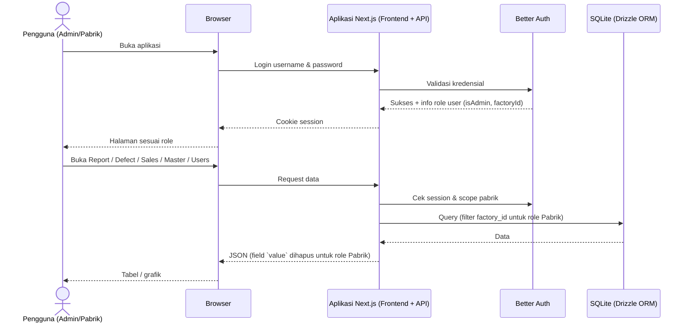
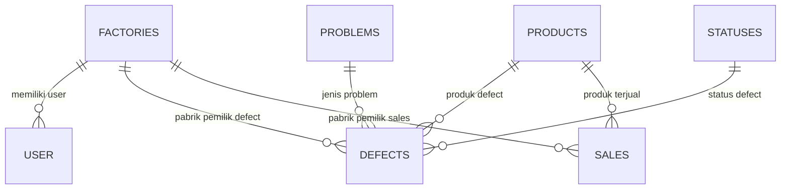

# BARDI Defect Report — Web Analisa Defect & Sales Produk

> **Dokumen ini adalah PRD lengkap + dokumentasi implementasi terkini (single source of truth).**
> Cocok dipakai sebagai konteks awal untuk sesi baru (AI agent / harness lain).
> `PRD.md` adalah dokumen kebutuhan awal; README ini adalah versi terupdate yang sudah disinkronkan dengan implementasi.

- **Repo**: https://github.com/riswannh/BARDI-Defect-Report (private, branch `main`)
- **Status**: semua fase PRD selesai diimplementasikan + revisi lanjutan (i18n, bulk action, delete-all dengan backup, searchable dropdown, redesign brand, Docker) + revisi alur input defect & navigasi mobile + modul **PO Product** dengan **master Harga Produk** per bulan/tahun (Value RW): Harga RW terisi otomatis dari periode tanggal/PO (jatuh ke harga terbaru kalau periode itu kosong) dan Defect menyimpan **Total Value = Harga RW × Quantity**, plus kartu **Replacement** di Report

---

## Daftar Isi

1. [Ringkasan Produk](#1-ringkasan-produk)
2. [Status Implementasi](#2-status-implementasi)
3. [Tech Stack](#3-tech-stack)
4. [Arsitektur](#4-arsitektur)
5. [Struktur Folder](#5-struktur-folder)
6. [Database Schema](#6-database-schema)
7. [API Reference](#7-api-reference)
8. [Fitur & Aturan Bisnis per Modul](#8-fitur--aturan-bisnis-per-modul)
9. [Ringkasan Aturan Bisnis Penting](#9-ringkasan-aturan-bisnis-penting)
10. [Hak Akses](#10-hak-akses)
11. [Setup & Menjalankan](#11-setup--menjalankan)
12. [Environment Variables](#12-environment-variables)
13. [Kredensial & Data Seed](#13-kredensial--data-seed)
14. [Workflow Git (WAJIB)](#14-workflow-git-wajib)
15. [Catatan Teknis & Gotcha](#15-catatan-teknis--gotcha)
16. [User Flow](#16-user-flow)

---

## 1. Ringkasan Produk

Aplikasi **Web Analisa Defect dan Sales Produk** dibuat untuk menggantikan pencatatan manual berbasis Google Spreadsheet yang selama ini dipakai staff pabrik. Data defect dan sales yang tersebar di banyak spreadsheet membuat rekap lambat, rawan salah, dan sulit melihat tren per produk maupun per pabrik.

Tujuan utama:

- Menyimpan seluruh data **defect** dan **sales** di satu tempat yang rapi dan terpusat.
- Membantu pengguna membuat **laporan otomatis** harian, mingguan, bulanan, tahunan, atau rentang tanggal tertentu.
- Menampilkan perbandingan defect vs sales dalam bentuk **grafik dan tabel rekap per produk**.
- Mengatur hak akses **Admin** dan **Pabrik** (pembatasan data per pabrik + penyembunyian nilai/value).
- Mendukung **impor dan ekspor Excel** agar perpindahan data dari spreadsheet lama mudah.

Keberhasilan diukur dari kebiasaan pengguna mengisi **Data Defect** dan **Data Sales**, sehingga laporan tersaji otomatis tanpa rekap manual.

### Target Pengguna

- **Admin** — mengelola semua data, master, user, dan melihat seluruh pabrik/nilai.
- **Pabrik** — hanya melihat laporan data pabriknya sendiri, tanpa nilai/value, dan hanya menu Report.

---

## 2. Status Implementasi

| Fase | Nama | Status |
|---|---|---|
| 1 | Laporan Analisis (Report) | ✅ Selesai + revisi (chart defect-only, pie, yearly sales, popup detail, paging) |
| 2 | Data Sales & Data Defect (CRUD + filter + Excel) | ✅ Selesai + revisi (bulk action, periode, pencarian) |
| 3 | Data Master & User Management | ✅ Selesai + paging |
| 4 | Login & Hak Akses | ✅ Selesai (Better Auth, role guard, scoping pabrik, value disembunyikan) |
| 5 | Impor & Ekspor Excel | ✅ Selesai + tracing error/skip, template, backup sebelum delete-all |
| + | i18n (Indonesia/English/中文) | ✅ Selesai |
| + | Docker & deployment lokal | ✅ Selesai (healthcheck, bind mount data) |
| + | Searchable dropdown (semua select) | ✅ Selesai (autofocus + reset saat ditutup) |
| + | Hapus semua data dengan backup otomatis | ✅ Selesai |
| + | Bulk edit / bulk delete (Defect & Sales) | ✅ Selesai |
| + | Alur input defect cepat (timestamp otomatis, simpan & tambah lagi, saran kode garansi, autofocus, konfirmasi buang isian) | ✅ Selesai |
| + | Navigasi mobile (sidebar jadi sheet di < lg) — semua halaman bebas overflow di 390px | ✅ Selesai |
| + | Perbaikan bug Select: nilai terpilih tidak lagi direset `null` saat popup ditutup | ✅ Selesai |
| + | **PO Product** (`/po`) — CRUD, filter periode, PPN, Excel, akses baca-saja untuk Pabrik | ✅ Selesai |
| + | **Harga Produk** per bulan/tahun (master) + salin periode sebelumnya | ✅ Selesai |
| + | **Value RW** di PO dihitung dari harga master | ✅ Selesai |
| + | **Harga RW** Defect jadi Harga + Total Value (harga × qty), Harga RW otomatis ikut periode (fallback harga terbaru) di Defect & PO | ✅ Selesai |
| + | Susunan field **Harga RW + Total Value** di form Defect disamakan dengan form PO (dropdown harga + kolom baca-saja), label "Value RW" diganti "Total Value" | ✅ Selesai |
| + | Kartu **Replacement** di Report + Total/Nilai Defect jadi angka bersih | ✅ Selesai |
| + | Perbaikan dialog Sales (X tidak menutup) + isi dialog meluber keluar kartu | ✅ Selesai |
| + | Build image Docker untuk deploy (`bardi-defect-report:latest`, diuji jalan dengan data asli) | ✅ Selesai |
| + | Image Docker dirampingkan (multi-stage: dependensi produksi saja, tanpa tool build) | ✅ Selesai |
| + | Value RW Defect: satu isian nilai, `productPriceId` dikosongkan, isian awal dari harga master | ✅ Selesai |

---

## 3. Tech Stack

| Bagian | Teknologi | Versi (package.json) |
|---|---|---|
| Framework | Next.js (App Router) | 16.3.4 |
| UI | React | 19.2.8 |
| Styling | Tailwind CSS v4 + tw-animate-css | ^4 |
| Komponen | shadcn/ui v4 berbasis **Base UI** (`@base-ui/react`) | ^1.8.0 |
| Ikon | lucide-react | ^1.43.0 |
| Grafik | Recharts | ^3.10.1 |
| Notifikasi | sonner | ^2.0.8 |
| Tema | next-themes | ^0.4.6 |
| Auth | Better Auth (username plugin) | ^1.7.4 |
| ORM | Drizzle ORM | ^0.45.2 |
| Database | SQLite (better-sqlite3) | ^12.11.1 |
| Excel | SheetJS (xlsx) | ^0.18.5 |
| Validasi | zod | ^4.6.1 |
| Bahasa | TypeScript | ^5 |
| Runtime script | tsx | ^4.23.13 |
| Deployment | Docker (node:22-bookworm-slim), docker compose | — |

Catatan dependensi:

- `@swc/helpers` **wajib** terpasang sebagai devDependency (tanpa ini dev server error "Panic in async function").
- `drizzle-kit` dan `tsx` ada di **`dependencies`** (bukan devDependencies) karena dipakai saat
  container produksi start: `drizzle-kit push` untuk menyinkronkan schema dan `tsx` untuk `db:seed`.
  Memindahkannya ke devDependencies akan membuat container gagal start kecuali perintah start-nya ikut diubah.

---

## 4. Arsitektur

Aplikasi web full-stack satu codebase (Next.js App Router):

- **Frontend** — tampilan, grafik, form, tabel (React Server/Client Components).
- **Backend/API** — Next.js Route Handlers: autentikasi, guard role, validasi zod, query Drizzle, impor/ekspor Excel.
- **Database** — SQLite (file), diakses via Drizzle + better-sqlite3.
- **Session** — cookie Better Auth; setiap request diperiksa role & scope pabrik.



Aturan server-side:

- **Admin** — akses semua data, semua pabrik, semua nilai.
- **Pabrik** — `scopedFactoryId()` otomatis mengunci `factoryId` user; field `value` dihapus dari respons oleh helper `stripValue()` (`src/lib/api/records.ts`, dipakai juga di `report.ts`).

---

## 5. Struktur Folder

```
Open Code Project/
├── PRD.md                  # PRD awal (dokumen ini = versi terupdate)
├── README.md               # ← dokumen ini (PRD + dokumentasi implementasi)
├── AGENTS.md               # aturan workflow untuk AI agent (git, docker, backend)
├── docker-compose.yml      # compose app (port 3000, bind mount ./data)
├── .env.example            # contoh env Docker (BETTER_AUTH_SECRET/URL)
├── data/                   # SQLite runtime + file backup (tidak di-commit)
└── frontend/               # aplikasi Next.js
    ├── Dockerfile          # multi-stage build + drizzle push + seed + next start
    ├── drizzle.config.ts
    ├── drizzle/            # migrasi yang digenerate
    ├── public/logo.png     # logo brand (256×256)
    ├── .env                # DB_FILE_NAME=../data/sqlite.db (tidak di-commit)
    └── src/
        ├── app/
        │   ├── login/page.tsx
        │   ├── (dashboard)/            # layout dengan sidebar + header + guard
        │   │   ├── report/            # page.tsx + report-charts.tsx
        │   │   │                      #   + report-data.ts + product-detail-dialog.tsx
        │   │   ├── defects/           # page.tsx + defect-form-dialog.tsx
        │   │   │                      #   + defect-detail-dialog.tsx + defect-form.ts
        │   │   ├── sales/page.tsx
        │   │   ├── master/page.tsx
        │   │   └── users/page.tsx
        │   └── api/                    # route handlers (lihat API Reference)
        ├── components/
        │   ├── ui/                     # shadcn/Base UI (select.tsx = searchable dropdown,
        │   │                           #   sheet.tsx = drawer navigasi mobile)
        │   ├── admin-guard.tsx         # redirect role Pabrik dari halaman admin
        │   ├── auth-guard.tsx          # redirect ke /login jika belum login
        │   ├── confirm-dialog.tsx      # konfirmasi tindakan (mis. buang isian form)
        │   ├── sidebar-nav.tsx         # isi navigasi (dipakai sidebar tetap & sheet)
        │   ├── delete-all-dialog.tsx
        │   ├── import-result-dialog.tsx
        │   ├── language-switcher.tsx
        │   ├── master-list.tsx         # tabel CRUD generik untuk data master
        │   ├── pagination.tsx          # paging + pilih ukuran + lompat halaman
        │   ├── sidebar.tsx, header.tsx, page-header.tsx, summary-card.tsx
        └── lib/
            ├── analytics.ts            # rekap per produk, bucket grafik, rasio
            ├── api-client.ts           # fetch wrapper (GET/POST/PATCH/DELETE)
            ├── auth-client.ts          # Better Auth client
            ├── auth-context.tsx        # useAuth() → session user
            ├── format.ts               # formatIDR, formatNumber, formatDateTime, MONTHS
            ├── i18n.ts                 # id/en/zh + useLanguage()
            ├── period.ts               # PeriodFilter + matchesDefectPeriod/matchesSalePeriod
            ├── types.ts                # tipe data bersama
            ├── use-api.ts              # hook fetch data (loading/error/reload)
            ├── api/                    # logika server: guard, response, validation,
            │                           # master, records, users, excel, bulk, report
            └── db/                     # schema.ts, index.ts, seed.ts
```

---

## 6. Database Schema

Sumber: `frontend/src/lib/db/schema.ts`.

### Tabel Aplikasi

**`factories`** — `id` (PK auto), `name` (unik), `createdAt`

**`products`** — `id` (PK auto), `name` (unik), **`sku`** (unik, opsional/nullable), `createdAt`
> `sku` opsional karena produk lama belum memilikinya; di SQLite beberapa baris `NULL` tidak saling bentrok pada constraint UNIQUE, sehingga produk tanpa SKU tetap valid sementara SKU yang diisi tidak bisa terduplikasi.

**`problems`** — `id` (PK auto), `name` (unik), `createdAt`

**`statuses`** — `id` (PK auto), `name` (unik), `createdAt`

**`product_prices`** — harga produk per bulan dan tahun, **selalu Rupiah**

| Kolom | Tipe | Keterangan |
|---|---|---|
| `id` | integer PK auto | |
| `productId` | FK → products | |
| `price` | real (default 0) | Rupiah; boleh pecahan |
| `month` | text | `"01"`..`"12"` (dua digit supaya bisa diurutkan sebagai teks) |
| `year` | text | empat digit |
| `createdAt` / `updatedAt` | timestamp | |

Constraint unik: `(productId, year, month)` — **satu harga per produk per periode**. Harga lama tidak
pernah ditimpa: kalau harga berubah, buat baris baru untuk periode berikutnya.

> Keterangan PO **bukan** master: ketiga nilainya di-hardcode di kode
> (`KETERANGAN_OPTIONS` di `src/lib/api/validation.ts`) dan disimpan sebagai teks pada baris PO.

**`purchase_orders`** — baris PO Product

| Kolom | Tipe | Keterangan |
|---|---|---|
| `id` | integer PK auto | |
| `poNumber` | text | diinput manual; **boleh berulang** |
| `poDate` | text | **tanggal PO, diisi manual operator**, format `YYYY-MM-DDTHH:mm` |
| `productId` | FK → products | SKU tidak disimpan di sini — SKU melekat pada produk |
| `factoryId` | FK → factories | |
| `quantity` | integer (default 0) | |
| `pricePerPcs` | **real** (default 0) | boleh pecahan (USD/RMB) |
| `value` | **real** (default 0) | `pricePerPcs × quantity`, **selalu dihitung ulang di server** |
| `currency` | text (default `Rp`) | `Rp`, `USD`, atau `RMB` |
| `ppn` | text (default `Non PPN`) | `PPN` atau `Non PPN`. **Hanya penanda — tidak dihitung ke `value`.** Tidak dikirim ke role Pabrik |
| `keterangan` | text (default `Product Order`) | salah satu dari tiga nilai tetap: `Product Order`, `Sparepart Order`, `Replacement` |
| `productPriceId` | FK → product_prices (nullable) | harga master (Rupiah) yang dipakai baris ini; NULL bila produk itu belum punya harga di periode PO |
| `createdAt` / `updatedAt` | timestamp | jejak audit, tidak ditampilkan di tabel |

Index: `factoryId`, `poNumber`, `keterangan`, `poDate`. **Tidak ada constraint UNIQUE** — satu PO
Number boleh diinput berkali-kali, termasuk untuk produk yang sama, dan sistem tidak menolak
duplikat (keputusan pemilik produk).

**`defects`**

| Kolom | Tipe | Keterangan |
|---|---|---|
| `id` | integer PK auto | |
| `codeGaransi` | text **unik** | kunci deteksi duplikat impor |
| `timeStamp` | text | datetime lengkap, format `YYYY-MM-DDTHH:mm` |
| `photosLink` / `videosLink` | text (default "") | tautan media (bukan upload) |
| `problemId` | FK → problems | |
| `problemDetail` | text (default "") | |
| `productId` | FK → products | |
| `quantity` | integer (default 0) | |
| `statusId` | FK → statuses | |
| `factoryId` | FK → factories | |
| `value` | integer (default 0) | IDR. **Total baris** = Harga RW × Quantity yang dihitung di form; untuk impor Excel diambil apa adanya dari kolom Value. Server tidak menghitung ulang; **disembunyikan untuk role Pabrik** |
| `productPriceId` | FK → product_prices (nullable) | Kolom warisan. Tidak diisi lagi untuk defect (selalu NULL pada baris baru, dan ikut dikosongkan saat baris lama disunting). Harga master kini hanya jadi **isian awal** di form — lihat §8.9 |
| `createdAt` / `updatedAt` | timestamp | |

Index: `factoryId`, `productId`, `timeStamp`.

**`sales`**

| Kolom | Tipe | Keterangan |
|---|---|---|
| `id` | integer PK auto | |
| `productId` | FK → products | |
| `factoryId` | FK → factories | |
| `month` | text | 3 huruf, contoh `Jan` |
| `quantity` | integer (default 0) | |
| `value` | integer (default 0) | IDR; disembunyikan untuk Pabrik |
| `createdAt` / `updatedAt` | timestamp | |

Constraint unik: `(productId, factoryId, month)` — kunci deteksi duplikat impor. Index: `factoryId`.

### Tabel Better Auth

- **`user`** — `id` (text PK), `name`, `email` (unik), `emailVerified`, `image`, `createdAt`, `updatedAt`, `username` (unik, plugin username), `displayUsername`, **`isAdmin`** (boolean), **`factoryId`** (FK → factories, `onDelete: set null`).
- **`session`** — `id`, `expiresAt`, `token` (unik), `ipAddress`, `userAgent`, `userId` (FK cascade), timestamps. Index `userId`.
- **`account`** — `id`, `accountId`, `providerId`, `userId` (FK cascade), token fields, `password` (hash), timestamps. Index `userId`.
- **`verification`** — `id`, `identifier`, `value`, `expiresAt`, timestamps. Index `identifier`.

### Aturan Duplikat Impor Excel

| Modul | Data dianggap sama jika |
|---|---|
| Defect | `codeGaransi` sudah ada |
| Sales | kombinasi `productId + factoryId + month` sudah ada |
| Produk / Problem / Status / Factory | `name` sudah ada |
| Produk (tambahan) | `sku` sudah dipakai produk lain — baris dilewati dengan alasan "SKU sudah dipakai", termasuk bila bentrok dengan baris lain di berkas yang sama |
| User | `username` sudah ada |

### Diagram Relasi



---

## 7. API Reference

Semua endpoint ada di `frontend/src/app/api/`. Auth via cookie session Better Auth.

### Auth

| Method | Path | Akses | Keterangan |
|---|---|---|---|
| * | `/api/auth/[...all]` | publik | handler Better Auth (login, logout, session) |

### Diagnostik Klien

| Method | Path | Akses | Keterangan |
|---|---|---|---|
| POST | `/api/client-errors` | user login | catat kegagalan jaringan dari browser (URL, method, body, pesan + stack error, `online`, jumlah percobaan, user agent). Satu baris JSON per kejadian di `<folder database>/client-errors.log`, bergilir ke `.log.1` pada 2 MB |

### Data Master (CRUD)

Berlaku untuk `products`, `problems`, `statuses`, `factories`:

| Method | Path | Akses | Keterangan |
|---|---|---|---|
| GET | `/api/{module}` | user login | daftar data (`factories` di-scope untuk role Pabrik) |
| POST | `/api/{module}` | admin | tambah (`name` unik; `products` menerima `sku` opsional yang juga harus unik) |
| PATCH | `/api/{module}/{id}` | admin | ubah (409 "Nama sudah ada." / "SKU sudah dipakai produk lain.") |
| DELETE | `/api/{module}/{id}` | admin | hapus (409 jika masih dipakai defect/sales) |
| DELETE | `/api/{module}` | admin | **hapus semua** (backup otomatis dulu) |

> **Keterangan PO bukan master.** Ketiga nilainya di-hardcode di
> `KETERANGAN_OPTIONS` (`src/lib/api/validation.ts`): `Product Order`, `Sparepart Order`,
> `Replacement` (default `Product Order`). Tidak ada tabel, endpoint, tab Data Master, maupun modul
> Excel untuk keterangan; baris PO menyimpan namanya sebagai teks.

**Produk punya `sku` di samping `name`** — dikelola di tab **Produk** (Data Master), ikut diekspor
dan diimpor lewat Excel (`template-produk.xlsx` memuat kolom `Nama` + `SKU`). Master lain
(problem/status/pabrik) tetap hanya nama. SKU kosong dikirim sebagai string kosong dan disimpan
sebagai `NULL`.

### Records

**Defects**:

| Method | Path | Akses | Keterangan |
|---|---|---|---|
| GET | `/api/defects` | user login | daftar + `factoryName`, `problemName`, `statusName`; role Pabrik ter-scope & tanpa `value`/`productPrice*` |
| POST | `/api/defects` | admin | tambah (validasi zod, cek `codeGaransi` unik) |
| PATCH | `/api/defects/{id}` | admin | ubah |
| DELETE | `/api/defects/{id}` | admin | hapus |
| DELETE | `/api/defects` | admin | hapus semua + backup otomatis |
| POST | `/api/defects/bulk-delete` | admin | hapus banyak `{ ids: number[] }` |

**Sales**: sama polanya (`/api/sales`, `/api/sales/{id}`, `/api/sales/bulk-delete`), validasi unik `productId+factoryId+month`.

**Harga RW Defect dipilih otomatis, angka tersimpannya tetap dihitung di form**: isian **Harga RW**
(harga satuan per pcs) terisi sendiri dari harga master produk untuk periode `timestamp` defect; kalau
produk itu belum punya harga di periode tersebut, dipakai **harga terbarunya** (bulan/tahun terbesar).
Operator memilih baris harga lain lewat **dropdown Harga RW** yang sama (susunannya sengaja dibuat sama
dengan form PO). **Total Value** (= Harga RW × Quantity) ditampilkan sebagai preview dan itulah yang dikirim
ke `defects.value` — server menyimpannya apa adanya, tidak menghitung ulang, dan **tidak mengisi
`productPriceId`**. Karena itu menambah harga master baru tidak mengubah baris defect lama, sedangkan
impor Excel tetap memakai kolom `Value` di berkas apa adanya (tanpa dikalikan quantity lagi). Role
Pabrik tidak menerima `value` **maupun** `productPrice*`. Modul **PO Product** memakai aturan pemilihan
harga yang sama tetapi menyimpan **rujukan** harga (§8.10).

### PO Product

| Method | Path | Akses | Keterangan |
|---|---|---|---|
| GET | `/api/purchase-orders` | user login | daftar + `productName`, `factoryName`, `sku`, `keterangan`, `productPrice`/`productPriceMonth`/`productPriceYear` (harga master). Query: `factoryId`, `productId`, `keterangan` (teks), `month`, `year`, `search`. Role Pabrik ter-scope pabriknya dan **tanpa** `pricePerPcs`/`value`/`currency`/`ppn`/`productPrice*` |
| POST | `/api/purchase-orders` | admin | tambah; **tanpa** pemeriksaan duplikat; `value` dihitung server |
| PATCH | `/api/purchase-orders/{id}` | admin | ubah sebagian; `value` dihitung ulang dari nilai final |
| DELETE | `/api/purchase-orders/{id}` | admin | hapus satu baris |
| DELETE | `/api/purchase-orders` | admin | hapus semua + backup otomatis |
| POST | `/api/purchase-orders/bulk-delete` | admin | `{ ids: number[] }` |

### Report

| Method | Path | Akses | Query params |
|---|---|---|---|
| GET | `/api/report` | user login | `period` (`daily/weekly/monthly/yearly/custom`), `month`, `year`, `day`, `weekEnd`, `from`, `to`, `factoryId` (admin) |

Respons berisi: `period`, `defects`, `sales`, `replacementPos`, `recap`, `buckets`, `salesYearly`,
`salesYearlyRecap`, `totals`, `years`, `products`, `problems`, `statuses`, `factories`.
Semua perhitungan (rekap, bucket grafik, total) dilakukan **di server**.

`replacementPos` adalah baris PO berketerangan **`Replacement`** pada periode terpilih, dan
`totals.replacementQty` dipakai kartu **Replacement** di halaman Report. Periodenya dicocokkan
dengan `matchesDefectPeriod` karena `poDate` berformat sama dengan timestamp defect
(`YYYY-MM-DDTHH:mm`).

`totals` memuat **dua kelompok angka**:

| Field | Isi |
|---|---|
| `defectQty`, `defectValue` | angka **mentah** — dipakai grafik, pie, dan tabel rekap |
| `replacementQty`, `replacementValue` | dari baris PO Replacement (`replacementValue` = `pricePerPcs × quantity`) |
| `replacementRwValue` | `Σ (quantity × harga master)` — **Rupiah**, sebanding dengan `defectValue` |
| `netDefectQty`, `netDefectValue` | **angka kartu ringkasan**: defect dikurangi Replacement, dibatasi bawah 0 |

Role Pabrik menerima qty-nya tetapi baris PO-nya **tanpa** `pricePerPcs`/`value`/`currency`, dan
`totals`-nya tanpa field nilai.

### Harga Produk (per bulan & tahun)

| Method | Path | Akses | Keterangan |
|---|---|---|---|
| GET | `/api/product-prices` | user login | daftar + `productName`/`sku`. Query: `productId`, `year`, `month` |
| POST | `/api/product-prices` | admin | tambah; 409 bila produk itu sudah punya harga di periode yang sama |
| PATCH | `/api/product-prices/{id}` | admin | ubah nominal/produk/periode |
| DELETE | `/api/product-prices/{id}` | admin | hapus; 409 bila masih dipakai baris PO |
| DELETE | `/api/product-prices` | admin | hapus semua + backup; 409 bila ada PO yang memakai |
| POST | `/api/product-prices/carry-forward` | admin | `{ month, year }` — salin harga dari periode terakhir sebelum periode itu |

**Value RW** pada baris PO = `quantity × harga master`. Baris PO menyimpan **rujukan**
(`productPriceId`), bukan salinan angkanya, sehingga menambah harga baru untuk periode lain tidak
mengubah nilai PO lama. Bila produk belum punya harga di periode PO, Value RW dikosongkan (`-`) dan
PO tetap boleh disimpan.

**`value` pada Defect dihitung di form, bukan di server.** Harga RW (harga satuan) × Quantity =
**Total Value**, dan total itulah yang dikirim ke `defects.value`; server menyimpannya apa adanya dan
tidak mengisi `productPriceId`. Harga RW sendiri terisi otomatis: harga master pada periode
`timestamp` defect, atau **harga terbaru** produk tersebut bila periode itu belum punya harga — dan
masih bisa diganti dengan memilih baris harga lain dari dropdown-nya. Nilai `value` yang sudah tersimpan
tidak dihitung ulang saat `quantity` diubah; mengubah quantity memang menghitung ulang total dari
Harga RW yang ada di form. Skrip satu kali `scripts/migrate-defect-price.ts` (menautkan defect lama ke
harga master) tidak diperlukan lagi.

**`carry-forward`** ada karena harga biasanya hanya berubah untuk sebagian produk: alih-alih
mengetik ratusan baris tiap bulan, salin dulu dari periode sebelumnya lalu sunting yang berubah.
Yang sudah ada di periode tujuan dilewati, jadi aman dijalankan berulang.

### Users

| Method | Path | Akses | Keterangan |
|---|---|---|---|
| GET | `/api/users` | admin | daftar user + `factoryName` |
| POST | `/api/users` | admin | buat user (username, password, isAdmin, factoryId) |
| PATCH | `/api/users/{id}` | admin | ubah (password opsional) |
| DELETE | `/api/users/{id}` | admin | hapus |
| DELETE | `/api/users` | admin | hapus semua **kecuali akun sendiri** + backup |

### Excel

Module: `products`, `problems`, `statuses`, `factories`, `defects`, `sales`, `users`, `purchase-orders`.

**PO Product** memakai kolom `PO Number`, `Timestamp`, `Produk`, `Pabrik`, `Quantity`, `PPN`,
`Price/pcs`, `Currency`, `Total`, `Keterangan` (berkas `po-product.xlsx`, template
`template-po-product.xlsx`). Ekspor untuk role Pabrik tidak memuat kolom `PPN`, `Price/pcs`,
`Currency`, dan `Total`. Impor **tidak** mendeteksi duplikat — baris hanya ditolak bila datanya
tidak valid (produk/pabrik/keterangan tidak ditemukan, atau PO Number/tanggal kosong), dan alasannya
dilaporkan per baris. `Total` selalu dihitung server, nilai di berkas diabaikan. Kolom `PPN` menerima
variasi penulisan (`ppn`, `non-ppn`, `PPN 11%`) dan dinormalkan ke `PPN` / `Non PPN`. Kolom
`Keterangan` hanya menerima ketiga nilai tetap; nilai asing membuat barisnya ditolak dengan alasan
yang menyebut pilihannya, dan sel kosong memakai default `Product Order`.

| Method | Path | Akses | Keterangan |
|---|---|---|---|
| GET | `/api/excel/{module}/export` | user login | unduh Excel data (role Pabrik: tanpa kolom value) |
| GET | `/api/excel/{module}/template` | user login | unduh template kosong |
| POST | `/api/excel/{module}/import` | admin | upload Excel (multipart) |

Respons import: `{ module, totalRows, inserted, skipped, errors[], skippedDetails[] }`.

- `errors[]` — baris gagal (row, key, reason), mis. referensi produk tidak ditemukan.
- `skippedDetails[]` — baris dilewati karena duplikat.
- Dialog `ImportResultDialog` menampilkan hasil + bisa unduh CSV; server mencatat log prefix `[import:{module}]`.

### Bulk (hapus banyak)

| Method | Path | Body |
|---|---|---|
| POST | `/api/defects/bulk-delete` | `{ ids: number[] }` |
| POST | `/api/sales/bulk-delete` | `{ ids: number[] }` |
| POST | `/api/purchase-orders/bulk-delete` | `{ ids: number[] }` |

---

## 8. Fitur & Aturan Bisnis per Modul

### 8.1 Login & Sesi

- Login memakai **username + password** (Better Auth `username` plugin; `emailAndPassword` aktif, email disintesis `<username>@pabrik.local` untuk user non-email).
- Session cookie berlaku 7 hari (`expiresIn`), refresh `updateAge` 1 hari.
- Halaman dilindungi `AuthGuard` (redirect ke `/login`).
- Halaman admin dilindungi `AdminGuard` (role Pabrik diarahkan ke `/report`).
- Halaman login tidak menampilkan akun demo.

### 8.2 Report (Laporan Analisis)

**Filter periode** (`src/lib/period.ts`):

| Periode | Parameter | Perilaku data |
|---|---|---|
| Harian (`daily`) | `day` | defect per jam (12 kolom 2-jam: `00:00 - 02:00` …); sales = total bulan terkait (nilai sama di tiap kolom) |
| Mingguan (`weekly`) | `weekEnd` | 7 kolom hari (tanggal berakhir + 6 hari sebelumnya) |
| Bulanan (`monthly`) | `month` + `year` | 12 kolom kelompok hari (mis. `1-3 Januari 2026`); tanpa opsi "Semua Bulan" |
| Tahunan (`yearly`) | `year` | 12 kolom bulan (Jan–Des) |
| Rentang (`custom`) | `from`, `to` | dikelompokkan maks 12 kolom (≤12 hari: per hari; >12: dibagi rata) |

**Grafik** (`src/lib/analytics.ts`, `buildChartBuckets`):

- Maksimum **12 kolom** per grafik.
- Grafik **defect-only**: tiap seksi = grafik batang (column) + pie proporsi defect per produk.
- **Grafik Sales selalu tahunan** (12 bulan, `salesYearly`) terlepas dari periode terpilih.
- Pie: top 7 produk + "Lainnya"; persentase di dalam slice; legend di kanan (urut persentase desc, nama dipotong); warna konsisten.

**Tabel Rekap Per Produk**:

- Kolom: Produk, Qty Defect, Value Defect (admin), Qty Sales, Value Sales (admin), Rasio.
- Pencarian produk, sorting (default **Qty Defect desc**), paging.
- Klik baris → dialog detail: tabel defect produk tersebut + paging, plus total Qty/Value defect dan grafik (batang + pie).
- **Rasio**: `defectQty / salesQty`; jika `salesQty = 0` dan `defectQty > 0` → **100%**; keduanya 0 → "-".
- Badge rasio: **< 1% hijau**, **1–2% kuning**, **> 2% merah**.

**Kartu ringkasan** (urut): Total Defect, Nilai Defect, Total Sales, Nilai Sales, Rasio Defect/Sales,
**Replacement**.

- **Total Defect & Nilai Defect menampilkan angka BERSIH**: `defectQty − replacementQty` dan
  `defectValue − Value RW Replacement` (Quantity × harga master, sama-sama Rupiah). Hasilnya
  **dibatasi bawah 0** — Replacement yang melebihi defect menampilkan `0`, bukan angka negatif.
  Rumusnya ditulis di keterangan kartu supaya pengurangannya terlihat.
- **Rasio Defect/Sales memakai angka defect bersih** agar konsisten dengan kartu Total Defect.
- **Kartu Replacement** = qty PO berketerangan `Replacement` pada periode terpilih.
- Angka **mentah** tetap dipakai grafik, pie, dan tabel rekap.
- Kartu **Nilai** (Nilai Defect, Nilai Sales) hanya tampil untuk admin; kartu lain tampil untuk semua role.

**Filter pabrik** (admin): dropdown searchable; role Pabrik terkunci pada pabriknya dan hanya melihat produk yang punya data di pabriknya.

**Default filter** (contoh data seed): `yearly`, tahun berjalan, `month=Jan`, `day=2026-04-07`, `weekEnd=2026-04-07`, `from=2026-01-01`, `to=2026-04-30`.

### 8.3 Data Defect

- Ringkasan total quantity & value defect (value hanya admin).
- Tabel: Code Garansi, Timestamp, Produk, Pabrik, Problem, Status, Qty, Value (admin).
- **Klik baris** → dialog detail defect.
- **Filter**: periode (harian/mingguan/bulanan/rentang), produk, problem, status, pabrik + **pencarian**.
- **Paging**: pilih ukuran 5/10/25/50/100 + lompat ke halaman.
- **Tambah/Ubah/Hapus**: form lengkap (Code Garansi, Timestamp `datetime-local`, link foto/video, Problem, Problem Detail, Produk, Qty, Status, Pabrik, **Harga RW**, **Total Value**).
- **Harga RW + Total Value (susunan sama dengan form PO)**: **Harga RW** adalah dropdown harga master produk. Saat produk dipilih, isiannya otomatis harga untuk bulan/tahun `timestamp` defect — kalau periode itu belum punya harga, dipakai **harga terbarunya** — dan operator bisa memilih baris harga lain dari dropdown yang sama. Di sebelahnya (kolom kedua grid) ada **Total Value** = Harga RW × Quantity sebagai kolom baca-saja dengan keterangan `harga × qty`, dan **itulah** yang dikirim ke `defects.value`; server menyimpannya apa adanya dan tidak mengisi `productPriceId`. Tombol **Tambah** selalu membuka form kosong; yang membawa produk/pabrik/status/harga ke entri berikutnya adalah **Simpan & tambah lagi**.
- **Alur input cepat** (untuk pengisian beruntun satu shift):
  - **Timestamp otomatis** diisi waktu sekarang saat menambah; tetap bisa diubah.
  - **Simpan & tambah lagi** menyimpan lalu langsung membuka entri berikutnya dengan **Produk, Pabrik, dan Status dibawa** dari entri sebelumnya; kode, qty, value, dan detail dikosongkan.
  - **Saran kode garansi**: prefiks diambil dari kode yang sudah ada di pabrik tersebut (mis. `WJKT-` untuk Pabrik Jakarta), lalu nomor urut berikutnya disarankan (mis. `WJKT-0004`). Tombol di samping kolom mengisinya sekali klik.
  - **Fokus otomatis** ke kolom Code Garansi saat dialog dibuka; **Ctrl/Cmd+Enter** menyimpan.
  - Menutup dialog yang masih berisi isian **meminta konfirmasi** lebih dulu.
- **Bulk**: checkbox baris → **Ubah massal** (dialog edit berurutan per data, judul `(1/N)`; Perbarui = simpan & lanjut ke data berikutnya) dan **Hapus massal**.
- **Excel**: import (duplikat `codeGaransi` di-skip), export, template.

### 8.4 Data Sales

- Ringkasan total quantity & value sales (value hanya admin).
- Tabel: Produk, Pabrik, Bulan, Qty, Value (admin).
- Filter produk/pabrik/bulan + pencarian; paging 5/10/25/50/100.
- Tambah/Ubah/Hapus (Produk, Pabrik, Bulan, Qty, Value); unik per `produk+pabrik+bulan`.
- Bulk ubah/hapus massal.
- Excel import/export/template.

### 8.5 Data Master

- Tab: **Produk**, **Problem**, **Harga Produk**, **Status** (komponen `master-list.tsx` untuk
  master nama, `price-list.tsx` untuk harga).
- **Tab Produk memakai dua kolom: Nama dan SKU.** Formulir tambah punya dua isian, baris daftar
  menampilkan nama dengan SKU di bawahnya (`Tanpa SKU` bila kosong), dan mode ubah menyediakan
  kedua isian. SKU opsional tetapi unik — duplikat ditolak dengan pesan "SKU sudah dipakai produk lain."
- **Tab Produk, Problem, dan Status punya kotak pencarian** di atas daftarnya: menyaring berdasarkan
  nama (tab Produk juga mencocokkan SKU), tidak peka huruf besar/kecil, dan cocok sebagian kata.
  Penyaringan dilakukan di `master/page.tsx` supaya jumlah halaman ikut hasil pencarian, dan bila
  tidak ada yang cocok muncul pesan "Tidak ada yang cocok dengan pencarian." (prop `emptyLabel` di
  `master-list.tsx` — tanpa itu pesannya "Belum ada data." yang menyesatkan).
- **Tab Harga Produk** mengelola harga per produk per **bulan + tahun** (selalu Rupiah). Kolom tabel:
  SKU · Nama Produk · Harga · Bulan · Tahun. Formulirnya memilih Produk, Harga, Bulan, Tahun.
  Perhatikan: **ubah harga ≠ timpa harga lama**. Harga baru dibuat sebagai baris baru untuk periode
  berikutnya, dan defect/PO lama tetap merujuk ke baris harganya masing-masing. Tombol **Salin harga
  periode sebelumnya** menyalin seluruh harga dari periode terakhir sebelum periode tujuan (yang sudah
  ada dilewati), jadi pergantian bulan tidak perlu mengetik ulang semua produk.
  Di atas tabel ada **filter**: kotak cari (nama produk atau SKU), pilihan **bulan**, dan pilihan
  **tahun**. Pilihan bulan/tahun diambil dari data yang ada (tidak ada periode kosong yang bisa
  dipilih), hasil filter langsung memengaruhi jumlah halaman, dan bila tidak ada yang cocok muncul
  pesan "Tidak ada harga yang cocok dengan filter."
  Tab ini tidak punya tombol Excel — impor/ekspor harga belum tersedia.
- CRUD + paging (5/10/25/50/100) + import/export/template Excel untuk master nama.
- Hapus master gagal (409) jika masih dipakai defect/sales; **hapus harga** gagal (409) bila masih
  dirujuk baris PO atau defect.
- **Hapus semua** per tab dengan dialog konfirmasi + backup otomatis.

### 8.6 User Management

- Tab: **User** dan **Pabrik**.
- User: username (boleh berisi spasi, validator `/^[a-zA-Z0-9 _.-]+$/`), password (hash), Pabrik, status Admin.
- Import users: pabrik yang belum ada **otomatis dibuat**; email disintesis; duplikat username di-skip.
- Hapus semua user mengecualikan akun sendiri.

### 8.7 Excel (Impor/Ekspor/Template)

- Tersedia di modul: `products`, `problems`, `statuses`, `factories`, `defects`, `sales`, `users`, `purchase-orders`.
  **Harga Produk belum punya Excel** (tombolnya nonaktif di tab itu) — harga diisi lewat UI atau tombol salin periode.
- Import: validasi per baris, referensi nama → id (produk/pabrik/problem/status harus ada), duplikat di-skip, hasil detail + CSV.
- Export role Pabrik: kolom value tidak ikut.
- Nama file export: `produk.xlsx`, `problem.xlsx`, `status.xlsx`, `pabrik.xlsx`, `defect.xlsx`, `sales.xlsx`, `users.xlsx`; template: `template-{modul}.xlsx`.

### 8.8 Hapus Semua Data (Delete All)

- `DELETE /api/{module}` (admin only).
- **Backup otomatis** dibuat dulu: `backup-{module}-{timestamp}.db` di folder data.
- Master data gagal dihapus (409) jika masih dipakai defect/sales.
- Users: akun sendiri dikecualikan.
- Dialog konfirmasi di UI (`delete-all-dialog.tsx`).

### 8.9 UI/UX Konvensi

- **Semua dropdown Select punya kotak pencarian** (`src/components/ui/select.tsx`):
  - Saat dropdown dibuka, fokus **langsung ke kotak pencarian** — bisa langsung mengetik.
  - Teks pencarian **di-reset saat dropdown ditutup**.
  - Item yang tidak cocok **disembunyikan (CSS `hidden`), bukan di-unmount** — mencegah Base UI mereset value terpilih menjadi `null`.
  - Fokus dikembalikan ke input jika popup merebut fokus (perilaku `onPointerLeave` Base UI saat item yang di-hover tersembunyi).
- **Pagination** (`pagination.tsx`): ukuran 5/10/25/50/100 + input lompat halaman.
- **Brand**: warna utama `#46BBC5` (dari logo), font **Plus Jakarta Sans**, logo `frontend/public/logo.png`.
- **i18n**: Indonesia (default), English, 中文 — hanya untuk label UI; data dari database tidak diterjemahkan. Preferensi disimpan di `localStorage` key `defect-sales-language`.

### 8.10 PO Product (`/po`)

Pencatatan purchase order per produk per pabrik.

**Halaman**: kartu ringkasan Total Quantity PO, tabel, filter, dan tombol Template/Import/Export/Hapus
Semua/Tambah. Halaman memakai **`AuthGuard`** (bukan `AdminGuard`) supaya role Pabrik bisa membukanya
baca-saja.

**Filter**: Produk, Pabrik, **Bulan**, **Tahun**, Keterangan, dan kotak Cari. Bulan/Tahun membaca
`poDate`. Filter dilakukan di klien agar sama persis dengan halaman Sales.

**Kolom tabel** (admin): PO Number, **Timestamp**, Keterangan, Nama Produk, Pabrik, Quantity, **PPN**,
Price/pcs, Total Currency, **Value RW**. Role Pabrik hanya melihat 6 kolom pertama (tanpa PPN/harga).

**Form**: PO Number, **Timestamp** (`datetime-local`, diisi operator, default waktu sekarang), Product
(satu dropdown berisi **nama produk saja** — SKU tidak ditampilkan di sini), Pabrik, Quantity,
Price/pcs, Currency (Rp/USD/RMB), **PPN** (PPN / Non PPN), **Harga RW**, Total Value (otomatis), dan
Keterangan (satu dari tiga nilai tetap).

- **Value RW** = `Quantity × harga master` dan **selalu Rupiah** — kolom terpisah dari Total yang
  mata uangnya bisa USD/RMB. **Harga RW** terisi otomatis mengikuti bulan/tahun timestamp PO; kalau
  produk belum punya harga di periode itu, dipakai **harga terbarunya**, dan operator tetap bisa
  memilih periode harga lain dari daftar. Kalau produknya belum punya harga sama sekali, PO **tetap
  bisa disimpan** dan Value RW ditampilkan `-`.
- **Timestamp** adalah tanggal PO yang diisi operator (bukan waktu input); wajib diisi.
- **`value`/Total selalu dihitung ulang di server** dari `pricePerPcs × quantity`; angka dari klien diabaikan.
- **PPN hanya penanda** — tidak menambah Total, tidak ada kolom nilai pajak/DPP.
- **Satu PO Number boleh diinput berkali-kali**, termasuk untuk produk yang sama: tidak ada `UNIQUE`
  dan tidak ada validasi duplikat di POST/PATCH maupun impor Excel.
- **SKU tidak disimpan** di baris PO (melekat pada `products.sku`); SKU tetap ikut di ekspor Excel.
- **Keterangan di-hardcode** (`Product Order` / `Sparepart Order` / `Replacement`); nilai asing jatuh ke
  default saat POST/PATCH, sedangkan pada impor Excel barisnya ditolak dengan alasan.
- Role Pabrik tidak menerima `pricePerPcs`, `value`, `currency`, `ppn`, maupun `productPrice*`.

---

## 9. Ringkasan Aturan Bisnis Penting

1. **Value (IDR) hanya untuk admin** — dihapus dari respons API untuk role Pabrik (`stripValue`),
   termasuk `productPrice*` pada defect/PO karena harga satuan bisa dipakai menghitung ulang value.
2. **Role Pabrik ter-scope** — `scopedFactoryId()` memaksa filter `factoryId` milik user; produk yang tampil di Report hanya yang punya data.
3. **Role Pabrik hanya menu Report** — sidebar menyembunyikan menu lain + `AdminGuard` redirect.
4. **Data sales tidak punya tahun** — pencocokan periode memakai bulan; grafik sales selalu tahunan 12 bulan.
5. **Rasio**: sales 0 + defect > 0 → 100%; keduanya 0 → tanpa rasio.
6. **Grafik maks 12 kolom**; pie top 7 + Lainnya.
7. **Timestamp defect lengkap** (tanggal + jam) — input `datetime-local`, filter periode membandingkan bagian tanggal.
8. **Impor idempotent** — data duplikat di-skip, bukan error; error per baris dilaporkan.
9. **Delete-all selalu backup dulu**; master yang masih dipakai tidak bisa dihapus (409).
10. **Dropdown search**: item non-match disembunyikan, bukan dihapus (lihat 8.9).
11. **Harga produk tidak pernah ditimpa** — satu harga per produk per bulan/tahun (unik), perubahan
    harga = baris baru. Baris PO & Defect menyimpan **rujukan** ke baris harga, jadi nilai lama tidak
    ikut berubah. Harga selalu Rupiah.
12. **`value` Defect = Harga RW × Quantity** (dihitung di form, server menyimpan apa adanya);
    Harga RW terisi otomatis dari periode timestamp atau harga terbaru produk — sama di PO Product.
13. **PO tanpa `UNIQUE`** — satu PO Number boleh diinput berkali-kali, termasuk produk yang sama.
14. **PPN hanya penanda** — tidak menambah Total, dan disembunyikan dari role Pabrik.
15. **Keterangan PO di-hardcode** — tidak ada master/CRUD-nya.

---

## 10. Hak Akses

| Fitur | Admin | Pabrik |
|---|---|---|
| Report | ✅ semua pabrik | ✅ pabriknya sendiri (nilai & harga disembunyikan) |
| Data Defect | ✅ CRUD | ❌ (hanya Report) |
| Data Sales | ✅ CRUD | ❌ |
| Data Master + Harga Produk | ✅ CRUD | ❌ |
| PO Product (`/po`) | ✅ CRUD | ✅ baca-saja, hanya PO pabriknya, tanpa harga/PPN |
| User Management | ✅ CRUD | ❌ |
| Import/Export Excel | ✅ | ❌ |
| Hapus semua data | ✅ | ❌ |
| Lihat Value (IDR) / harga / PPN | ✅ | ❌ |

---

## 11. Setup & Menjalankan

### Prasyarat

- Node.js 22+ (Docker image memakai `node:22-bookworm-slim`)
- npm

### Development (default)

```bash
cd frontend
npm install
cp .env.example .env        # lalu set DB_FILE_NAME=../data/sqlite.db (agar sama dengan Docker)
npm run db:push             # sinkronkan schema ke SQLite
npm run db:seed             # data awal (idempotent, skip jika sudah ada)
npm run dev                 # http://localhost:3000
```

Perintah lain:

- `npm run lint` — eslint
- `npx tsc --noEmit` — cek TypeScript
- `npm run build` / `npm start` — produksi
- `npm run db:generate` — generate migrasi Drizzle

### Docker

**Di mesin development (build image):**

```bash
cp .env.example .env        # isi BETTER_AUTH_SECRET (min 32 karakter)
docker compose up -d --build
```

- App: http://localhost:3000
- Image: `bardi-defect-report:latest` (**±1,23 GB**)
- Data SQLite: `./data/sqlite.db` (bind mount, tidak di-commit)
- Saat start container: `drizzle-kit push --force` → `npm run db:seed` (idempotent, dilewati bila
  database sudah berisi data) → `next start`
- Cek status: `docker compose ps` (ada healthcheck ke `/login`, `start_period` 90 detik)
- Log: `docker compose logs -f`; stop: `docker compose down`

**Isi image** (kenapa ukurannya segitu): `node_modules` **672 MB** (mayoritas `next` 202 MB +
`@next` 93 MB + `lucide-react` 44 MB), `.next` 39 MB, sisanya OS dasar dan sumber. `drizzle-kit` dan
`tsx` **wajib ikut** karena dipakai saat container start (`drizzle-kit push` dan `db:seed`), dan
keduanya karena itu berada di `dependencies`, bukan `devDependencies` — jangan dipindahkan kembali
tanpa mengganti perintah start-nya.

**Deploy ke server:**

Karena server tujuan bisa berbeda arsitektur/jaringan, image dipindahkan sebagai berkas:

```bash
# di mesin development — simpan image ke satu berkas
docker save bardi-defect-report:latest -o bardi-defect-report.tar

# salin ke server (scp/rsync/USB), lalu di server:
docker load -i bardi-defect-report.tar
```

Siapkan di server (satu folder):

```
docker-compose.yml
.env                 # BETTER_AUTH_SECRET + BETTER_AUTH_URL publik
data/                # folder database (boleh dikosongkan; schema dibuat otomatis)
```

Lalu:

```bash
docker compose up -d          # tanpa --build, image sudah ada dari docker load
docker compose ps             # tunggu sampai (healthy)
```

Hal yang wajib diperhatikan saat deploy:

| Hal | Keterangan |
|---|---|
| `BETTER_AUTH_URL` | **Ganti ke alamat publik server** (mis. `http://192.168.1.10:3000` atau `https://defect.contoh.com`). Kalau dibiarkan `localhost`, login bisa gagal dari browser lain. |
| `BETTER_AUTH_SECRET` | Wajib diganti, minimal 32 karakter, dan **jangan di-commit**. |
| Data lama | Untuk memakai data yang sudah ada, salin `data/sqlite.db` ke folder `data/` di server **sebelum** `up`. Tanpa itu container membuat database baru lalu mengisinya dengan data seed. |
| Backup | Fitur "Hapus semua" otomatis membuat `data/backup-*.db`. Sertakan folder `data/` dalam jadwal backup server. |
| Schema baru | Kalau nanti ada perubahan schema, cukup ganti image (`docker load` versi baru) lalu `docker compose up -d` — `drizzle-kit push` dijalankan otomatis saat container start. **Backup `data/sqlite.db` dulu** sebelum mengganti image yang mengubah schema. |
| Port | `3000:3000`. Kalau di server sudah dipakai, ubah sisi kiri (mis. `8080:3000`) dan sesuaikan `BETTER_AUTH_URL`. |
| Reverse proxy | Jalankan di belakang Nginx/Caddy untuk HTTPS; arahkan ke `127.0.0.1:3000`. Set `BETTER_AUTH_URL` ke URL HTTPS-nya. |

### PENTING: Dev vs Docker

- **Jangan** build Docker setiap ada perubahan — pakai `npm run dev` selama development.
- **Jangan** jalankan dev server dan container bersamaan (port 3000 bentrok).
- Development memakai database yang sama dengan Docker: `frontend/.env` → `DB_FILE_NAME=../data/sqlite.db`.

---

## 12. Environment Variables

**`frontend/.env`** (dev):

| Variabel | Contoh | Keterangan |
|---|---|---|
| `DB_FILE_NAME` | `../data/sqlite.db` | path file SQLite |
| `BETTER_AUTH_SECRET` | string acak ≥ 32 char | wajib, jangan di-commit |
| `BETTER_AUTH_URL` | `http://localhost:3000` | base URL auth |

**Root `.env`** (Docker):

| Variabel | Default | Keterangan |
|---|---|---|
| `BETTER_AUTH_SECRET` | — | wajib diisi |
| `BETTER_AUTH_URL` | `http://localhost:3000` | ganti jika diakses via domain/IP |

---

## 13. Kredensial & Data Seed

Seed idempotent (skip jika tabel `factories` sudah berisi data). Kredensial:

| Username | Password | Role |
|---|---|---|
| `admin` | `admin123` | Admin |
| `pabrik_jkt` | `pabrik123` | Pabrik Jakarta |
| `pabrik_sby` | `pabrik123` | Pabrik Surabaya |
| `pabrik_bdg` | `pabrik123` | Pabrik Bandung |

Data seed: 3 pabrik, 5 produk, 5 problem, 4 status, 7 defect (Jan–Apr 2026), 21 baris sales (Jan–Apr 2026), 4 user.

> Database produksi user berisi data asli (pabrik, produk, defect, sales hasil impor). Backup manual tersimpan di `data/backup-*.db`.

---

## 14. Workflow Git (WAJIB)

Setiap selesai mengerjakan perubahan fitur:

1. Jalankan pengecekan di folder `frontend`:
   - `npx tsc --noEmit`
   - `npx eslint`
2. `git add -A`
3. `git commit -m "<pesan deskriptif>"`
4. `git push`

- Repo: https://github.com/riswannh/BARDI-Defect-Report (branch `main`)
- Jangan commit file yang di-ignore (`node_modules`, `.next`, `data/`, `.env`, settings lokal `.claude`).
- Jika `git`/`gh` tidak dikenali di PATH: `C:\Program Files\Git\cmd\git.exe` dan `C:\Program Files\GitHub CLI\gh.exe`.

---

## 15. Catatan Teknis & Gotcha

### Base UI (shadcn v4)

- `Select.Value` menampilkan nilai mentah kecuali `Select.Root` diberi prop `items` (value+label).
- `DropdownMenuLabel` harus dibungkus `DropdownMenuGroup`.
- Saat popup Select terbuka, Base UI menangkap tombol karakter (typeahead) — input pencarian perlu `event.stopPropagation()` untuk `event.key.length === 1` agar bisa mengetik.
- **Jangan meng-unmount item Select saat filter** — Base UI mendeteksi value terpilih "hilang" dan mereset value ke `null` (bug "null" pada trigger). Gunakan class `hidden`.
- **Jangan memberi `key` yang berubah mengikuti status buka/tutup pada daftar item Select.** Ini penyebab utama bug `null` di atas: `SelectSearch` pernah memakai `key={open ? "open" : "closed"}` sehingga daftar item di-unmount tepat saat popup ditutup; Base UI lalu melaporkan peta item kosong lewat `SelectPositioner.onMapChange` dan mereset nilai yang baru dipilih. Gejalanya `onValueChange` terpanggil dua kali (`"2"` lalu `null`) dan data tidak pernah tersimpan. Kotak pencarian tetap ter-reset karena di-unmount bersama popup.
- Base UI memfokuskan popup saat pointer meninggalkan item (mis. item hover tersembunyi karena filter) — kembalikan fokus ke input pencarian via listener `focusin` pada popup.
- `useApi` mengosongkan data saat URL berubah (loading) — untuk daftar yang harus stabil (mis. pabrik di Report), fetch terpisah dari endpoint master.

### Lint & TypeScript

- ESLint `react-hooks/set-state-in-effect` melarang `setState` langsung di effect — gunakan pola derived state / `key` untuk reset state.
- Selalu jalankan `npx tsc --noEmit` + `npx eslint` sebelum commit.

### Testing UI (opsional)

Teknik yang dipakai untuk verifikasi browser: `playwright-core` (devDependency sementara) + Chrome lokal:

```js
const { chromium } = require("playwright-core");
const browser = await chromium.launch({
  executablePath: "C:\\Program Files\\Google\\Chrome\\Application\\chrome.exe",
  headless: true,
});
```

Jangan lupa hapus script test & uninstall `playwright-core` setelah selesai.

### "Failed to fetch" saat menyimpan

Gejalanya: menekan simpan gagal dengan `TypeError: Failed to fetch`, padahal **log Caddy tidak memuat
request itu sama sekali** — artinya request tidak pernah sampai ke server. Jadi ini bukan bug server,
bukan validasi, dan bukan 401: koneksi browser → server yang putus-nyambung (sering terjadi di
lapangan, dan request non-GET tidak diulang sendiri oleh browser).

Penanganannya:

- `src/lib/api-client.ts` — request **GET/PATCH** diulang sampai **3 percobaan** (jeda 0,4 s lalu 1,2 s).
  Angka itu dari pengukuran: pada sesi buruk sekitar **1 dari 4 request hilang** tanpa jejak di log
  server, jadi sekali ulangan belum cukup. PATCH di aplikasi ini menulis nilai tetap (`name`/`sku`,
  dsb.) sehingga aman diulang; **POST/DELETE/upload tidak diulang** supaya baris tidak tergandakan.
  Kalau tetap gagal: detailnya dikirim ke `/api/client-errors` (disimpan dulu di `localStorage` bila
  pengirimannya ikut gagal, lalu dikirim lagi begitu ada request yang berhasil), dan pesan
  `TypeError: Failed to fetch` diterjemahkan di sini menjadi kalimat yang bisa ditindaklanjuti —
  jadi halaman tidak perlu menanganinya sendiri-sendiri.
- `src/lib/use-api.ts` — **semua** pemuatan daftar (master, defects, sales, PO, report, users, header)
  lewat `apiGet`, jadi ikut diulang dan ikut tercatat. Saat pemuatan ulang gagal, data yang sudah
  tampil **dipertahankan**; dulu barisnya dikosongkan sehingga gangguan sesaat membuat tabel mendadak
  kosong seolah datanya hilang.
- `src/components/master-list.tsx` — saat penyimpanan gagal, formulir **tidak** mengosongkan isian:
  baris tetap dalam mode edit dan teksnya tinggal disimpan ulang. Handler `onAdd`/`onRename` karena
  itu mengembalikan `false` ketika gagal. Form defect/sales/PO sudah begitu sejak awal (dialog baru
  ditutup setelah `await` berhasil), jadi jangan diubah.
- `src/components/summary-card.tsx` — nilai rupiah bisa 17 karakter (`Rp 25.925.925.690`) sementara
  kartunya di halaman Report hanya selebar ~240 px. Ukuran huruf nilainya karena itu turun satu
  tingkat setiap nilainya bertambah panjang (≥12 karakter `text-xl`, ≥15 `text-lg`, ≥18 `text-base`)
  dan `break-words` dipasang sebagai jaring terakhir, jadi tidak ada angka yang terpotong. Kartu ini
  dipakai juga di halaman Defects, Sales, dan PO.
- **Halaman Report: grid kartu ringkasan memakai `2xl:grid-cols-6`, bukan `xl:grid-cols-6`.** Di
  layar 1280–1535 px enam kolom membuat kartu nilai berdesakan; sekarang rentang itu memakai 3 kolom
  dan enam kolom baru dipakai mulai 1536 px.

Memeriksa dari VPS: `tail -n 5 /opt/bardi/data/client-errors.log`.

### Hal lain

- `@swc/helpers` wajib ada — tanpa itu dev server error "Panic in async function".
- `data/` dan file `*.db` tidak di-commit.
- Drizzle push dipakai (bukan migrate) untuk sinkronisasi schema, termasuk di container.

---

## 16. User Flow

### 16.1 Admin — Setup Awal

1. Admin login.
2. Buka **User Management** → tambah **Pabrik**.
3. Buat akun: Admin (tanpa pabrik) dan Pabrik (terhubung ke pabrik).
4. Buka **Data Master** → atur **Produk** (nama + SKU), **Problem**, **Status**.
5. Buka tab **Harga Produk** → isi harga tiap produk untuk bulan/tahun berjalan. Untuk bulan
   berikutnya, ganti Bulan/Tahun lalu klik **Salin harga periode sebelumnya**, kemudian sunting hanya
   produk yang harganya berubah.
6. Aplikasi siap dipakai.

> Harga boleh diisi bertahap. Produk yang belum punya harga tetap bisa di-PO maupun dicatat
> defect-nya; nilainya saja yang dikosongkan/diisi manual sampai harganya tersedia.

### 16.2 Pencatatan Data Sales & Defect oleh Admin

1. Buka **Data Sales** → Tambah (atau Import Excel).
2. Data tampil di tabel + total quantity/value.
3. Buka **Data Defect** → Tambah Data Defect. Pilih produk, lalu **Harga RW** (dropdown harga master,
   susunannya sama dengan form PO) terisi otomatis sesuai bulan/tahun timestamp — kalau periode itu
   kosong, dipakai harga terbaru produk tersebut — dan bisa diganti dengan memilih baris harga lain.
   **Total Value** = Harga RW × Quantity tampil sebagai kolom baca-saja dan itulah nilai yang tersimpan.
4. Data lama dari spreadsheet diimpor via Excel (kolom Value di berkas dipakai apa adanya).
5. Buka **PO Product** → Tambah → isi PO Number, Timestamp, Product, Pabrik, Quantity, Price/pcs,
   Currency, PPN, dan Keterangan. **Harga RW** menentukan Value RW.

### 16.3 Penggunaan oleh Role Pabrik

1. Login username & password.
2. Sistem memeriksa factory user.
3. Menu **Report** dan **PO Product** yang tampil; PO dibuka dalam mode baca-saja.
4. Seluruh tombol tambah/ubah/hapus/import tidak ada.
5. Kolom value, harga (Price/pcs, Total, Currency, Value RW), PPN, dan harga master tidak muncul —
   hanya quantity.
6. Data hanya milik pabriknya sendiri.

### 16.4 Melihat Laporan Analisis

1. Buka **Report**.
2. Pilih periode: Harian / Mingguan / Bulanan / Tahunan / Rentang.
3. Admin bisa memilih pabrik; role Pabrik terkunci.
4. Sistem menampilkan grafik (defect + sales tahunan) dan tabel rekap per produk (quantity, value, rasio).
5. Klik produk untuk melihat detail defect + grafiknya.

### 16.5 Impor & Ekspor Data

1. Buka halaman CRUD yang diinginkan.
2. **Ekspor Excel** — unduh data yang sedang tampil.
3. **Impor**:
   - Unduh **Template** bila perlu.
   - Isi file sesuai format.
   - Upload via **Import Excel**.
   - Sistem melewati data duplikat, memasukkan data baru, dan menampilkan ringkasan hasil (berhasil/skip/error + unduh CSV detail).
