# PRD — Factory Role (BARDI Defect & Sales Portal)

| | |
| --- | --- |
| Document | Product Requirements — Factory (Pabrik) role |
| Version | 1.0 |
| Status | Implemented (Report, PO Product, Ticketing) — Ticketing still in preview mode |
| Owner | BARDI Product Team |
| Audience | Factory Team (China), BARDI Product Team, BARDI admin |
| Related | `SPEC-ticketing.md` (ticketing master plan), `AGENTS.md`, `PRODUCT.md` |

Every screenshot in this document was captured from the real application with a **factory account**
(`unknown` — factory "Unknown", `isAdmin = 0`), in both interface languages: `en-*.png` (English) and
`zh-*.png` (Chinese). Sign-in credentials for factory users are issued separately by the BARDI admin
(User Management).

---

## 1. Background

BARDI works with a factory team in China that produces the goods BARDI sells. Today the factory only
receives defect data indirectly. Two problems:

1. The factory needs a **self-service view**: which of its own products came back as defects, how many
   units were sold, and how the defect ratio looks over time.
2. The factory needs a **conversation channel** for a specific problem (a "ticket"), without exposing
   BARDI internal pricing or customer-support conversations.

The portal therefore gives the factory a restricted role: three menu items, its own data only, no
Rupiah (IDR) values anywhere, and a dedicated ticket chat room with the Product Team.

## 2. Goals and Non-goals

**Goals**

- The factory can sign in and see exactly three modules: Report, PO Product, Ticketing.
- All numbers are automatically limited to the products of the factory's own products (`factoryId`).
- No pricing (IDR) information ever reaches a factory account.
- A ticket that BARDI escalates to the factory is readable in the factory's own language, and the
  factory can answer, quote, edit, and open attachment previews in that same ticket.

**Non-goals (not part of this role)**

- Creating tickets (CS issues them), linking defect data, escalating to the factory (Product Team only).
- Managing masters (products, factories, users), Data Defect, Sales, Excel import/export — admin only.
- Seeing the CS ↔ Product Team room, comments, or any customer identity beyond the Virtual ID.

## 3. Users and access model

| Item | Behaviour |
| --- | --- |
| Account | Created by BARDI admin (User Management), linked to one `factoryId` |
| Data scope | Server-side: `scopedFactoryId()` in `frontend/src/lib/api/guard.ts:54` returns the user's own `factoryId`, so Report and PO queries can never return another factory's rows |
| Role label | Sidebar footer shows "Factory — limited access" (`nav.factoryAccess`) |
| Interface language | English / 中文 switch in the header (`frontend/src/components/language-switcher.tsx`) |
| Ticket content | Automatically shown in the factory's language, with a "Show original" toggle |
| Forbidden values | Every IDR / Rupiah card, column, and chart is behind `isAdmin &&` and is not even present in the API payload for a factory account (`PRODUCT.md:84`) |

## 4. Navigation

Factory accounts see three menus only. Sales, Data Defect, Data Master, and User Management are hidden.

- **Report** — defect and sales analysis for this factory (`/report`)
- **PO Product** — purchase orders of this factory, read-only (`/po`)
- **Ticketing** — tickets escalated to this factory (`/tickets`)

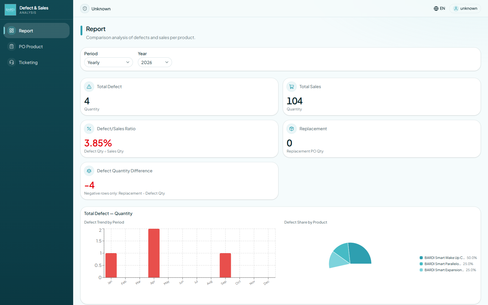

---

## 5. Feature 1 — Report

Route `/report`. Shows how this factory's products perform: defect volume, sales volume, and the ratio
between them.

**Requirements**

1. Period filter: Daily / Weekly / Monthly / Yearly / Custom, plus Month and Year selectors (Custom adds
   From / To dates). Default: Yearly, current year.
2. Summary cards for a factory account:
   - **Total Defect — Quantity**
   - **Total Sales — Quantity**
   - **Defect/Sales Ratio** (defect quantity ÷ sales quantity)
   - **Replacement — Replacement PO Qty**
   - **Defect Quantity Difference** (Replacement − Defect; negative rows only)
3. Charts: defect quantity trend by period + defect share per product (pie), sales quantity trend +
   sales share per product.
4. **Recap by Product** table: Product, Defect Qty, Sales Qty, Replacement, Defect Difference, Ratio —
   searchable, sortable by every column, paginated.
5. Clicking a product row opens the product detail popup: the product's defect rows for the selected
   period.
6. Clicking a defect row inside that popup opens the **same defect detail popup** as the Data Defect
   page (warranty code, timestamp, product, factory, problem, status, quantity, media).

**Not shown to a factory account:** Defect Value, Sales Value, Replacement Value, Difference Value,
value charts, value columns, and the Factory selector (all admin-only at
`frontend/src/app/(dashboard)/report/page.tsx:345,385-401,429-433,450-458,488-490,532-534,592,612,667,675`).

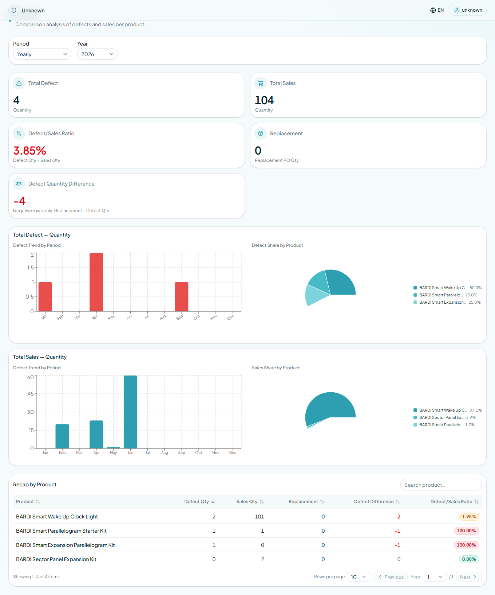

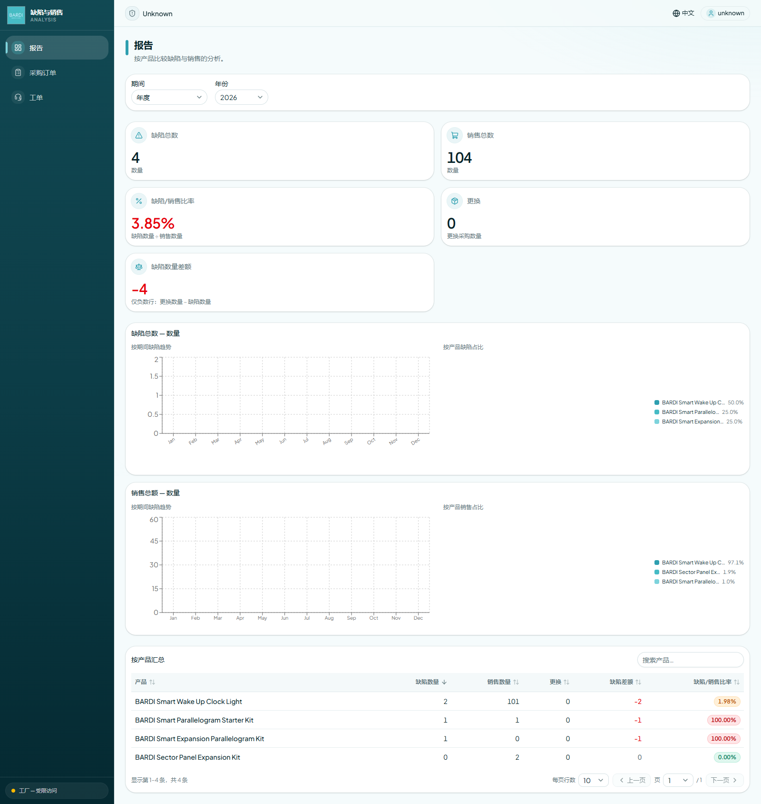

---

## 6. Feature 2 — PO Product

Route `/po`. The factory sees the purchase orders issued for its products. The page is read-only for
this role.

**Requirements**

1. Table columns (6): **PO NUMBER, TIMESTAMP, REMARKS, PRODUCT NAME, FACTORY, QUANTITY**.
2. Filters: product, month, year, remarks.
3. No create / import / export / delete buttons, no row selection, no price, no value, no PPN column
   (`frontend/src/app/(dashboard)/po/page.tsx:441,550,688,707,727-744,897`).

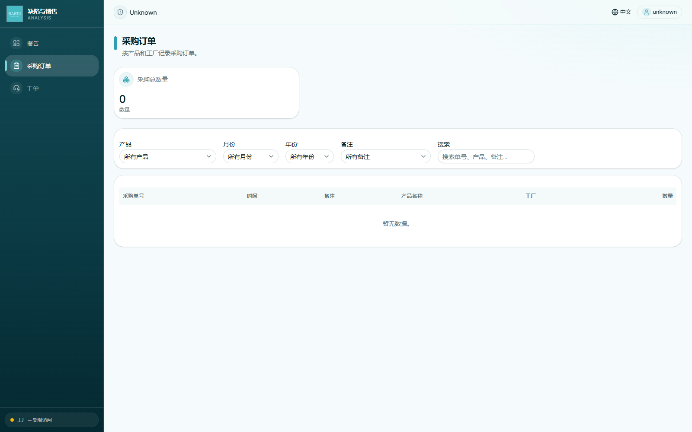

---

## 7. Feature 3 — Ticketing

Route `/tickets`. One ticket = one product problem, opened by CS, consulted with the Product Team, and
escalated to the factory when the Product Team cannot solve it alone.

> **Status:** the Ticketing module runs in **preview mode** — the screens are final, the data is sample
> data. The list page shows a "Preview mode" banner for that reason.

### 7.1 Ticket list

1. Banners: "Preview mode. Sample data, not saved to the server." and, for this role,
   "Factory access — forwarded tickets only".
2. Summary cards: Total Tickets, With Product Team, Forwarded to Factory, Solved.
3. Filters: role preview selector, factory, product, stage, free-text search (code, title, virtual ID),
   page size.
4. Table columns: Code (with a red **"New updates"** badge when a new message arrived), Title, Product,
   Virtual ID, Stage, Factory, Updated (no Actions column for this role).
5. Stages: "Handled by Product Team" → "Forwarded to Factory Team" → "Solved".
6. A factory account only sees tickets that were escalated to its own factory.

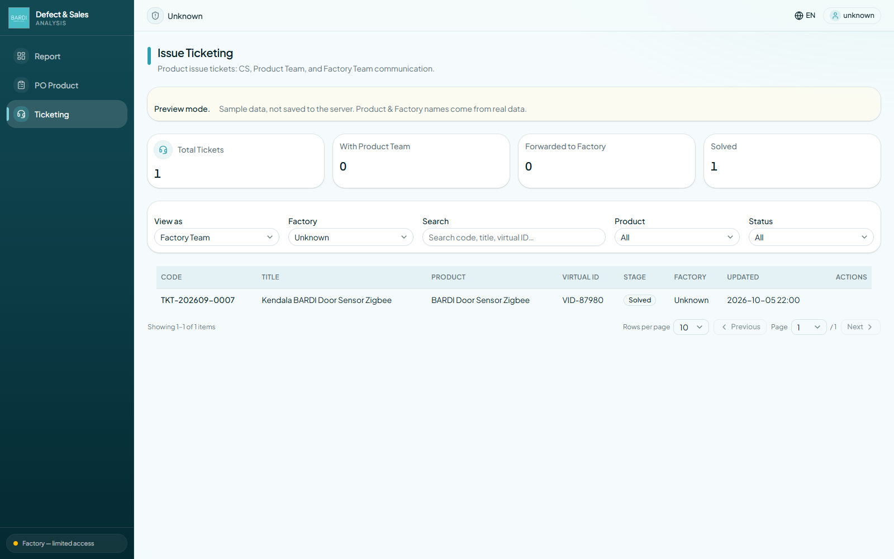
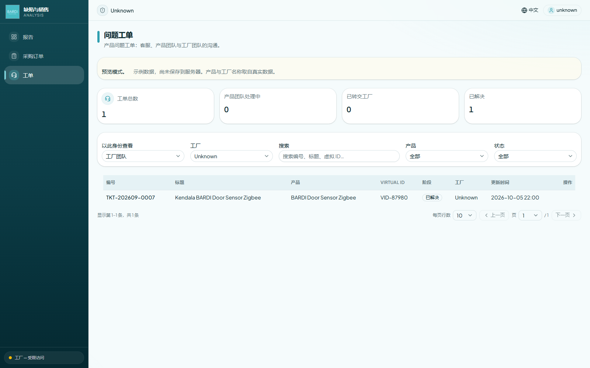

### 7.2 Ticket detail

1. Header: ticket code, stage badge, "Ticket List" back button; the page auto-refreshes every 10 seconds
   (`frontend/src/app/(dashboard)/tickets/[id]/page.tsx:302`).
2. Info card: Product, Virtual ID, Factory, Created, Forwarded, Solved, **Problem Description**,
   **Chronology**, **Solutions Already Tried**.
3. Related Defect Data: the defect rows the Product Team linked to this ticket (warranty code, timestamp,
   problem, status, quantity).
4. Actions: **Mark as Solved**, **Reopen**.
5. Attachment rule note: "A new ticket is stored on Google Drive. When it is forwarded to the factory,
   files are copied to the BARDI server and removed 30 days after the ticket is solved."

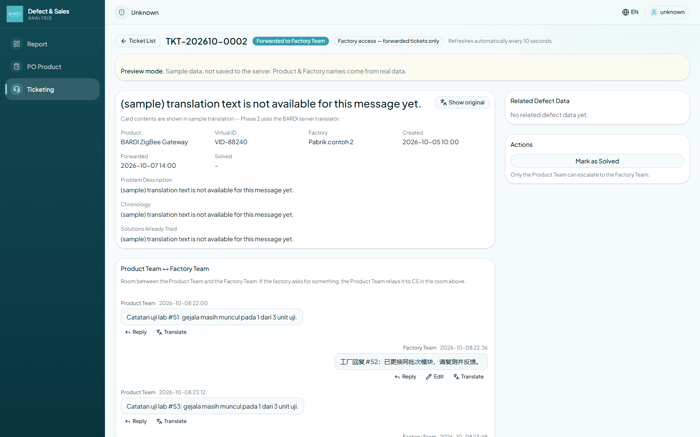
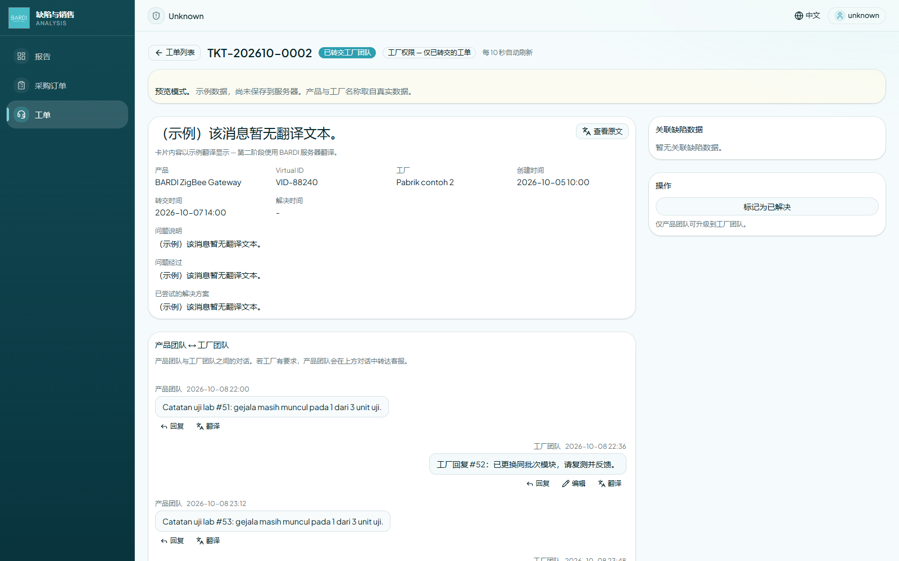

### 7.3 Conversation rooms

Two rooms exist per ticket, and the factory only sees the second one:

| Room | Participants | Visible to factory |
| --- | --- | --- |
| CS ↔ Product Team | CS and Product Team | **No** — the factory never sees the customer conversation |
| Product Team ↔ Factory Team | Product Team and Factory Team | **Yes** — this is the factory's work room |

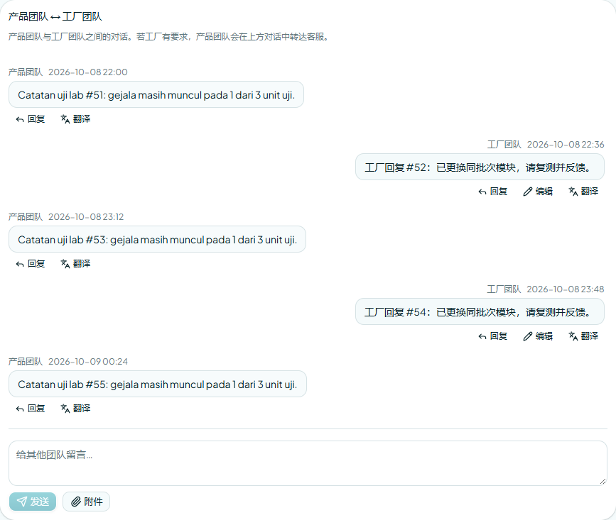

### 7.4 Chat behaviour (factory side)

1. **Send a message** — with the text box at the bottom of the room ("Write a message to the other team…").
2. **Reply / quote** — hover a bubble → "Reply"; the quoted message appears above the new message, and
   clicking the quote jumps to the original message (loading earlier history if needed).
3. **Edit your own message** — hover your own bubble → "Edit"; the bubble then shows "edited". Other
   people's messages cannot be edited, and history is never deleted.
4. **Translation** — the factory reads ticket content in its own language with a one-click
   "Show original" / "Translate" toggle. In preview mode the translation comes from a sample dictionary;
   the production translator (LibreTranslate on the BARDI server) arrives in Phase 2.
5. **Attachments** — files appear as bubbles inside the conversation (not stacked above the text box),
   each with a size, a storage badge (Google Drive / Server 30 days / This device), and a preview button
   that opens images, video, or audio in a popup.
6. **Forwarded attachments** — files the Product Team forwarded from CS appear in the factory room as
   normal bubbles carrying a **"Forwarded"** badge.
7. **Message window** — only the 10 latest messages are rendered; "Load 10 earlier messages" (and
   "Load all messages") fetch the rest, so a long ticket stays fast.

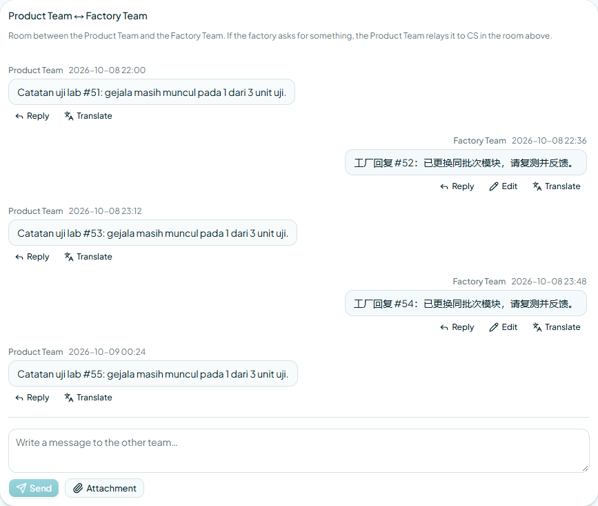
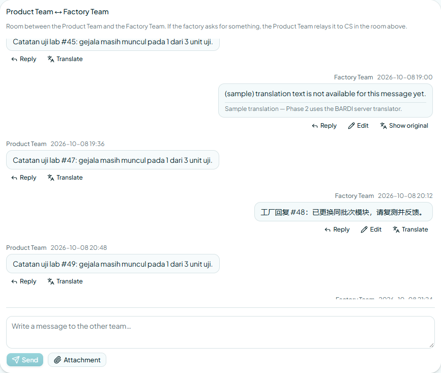

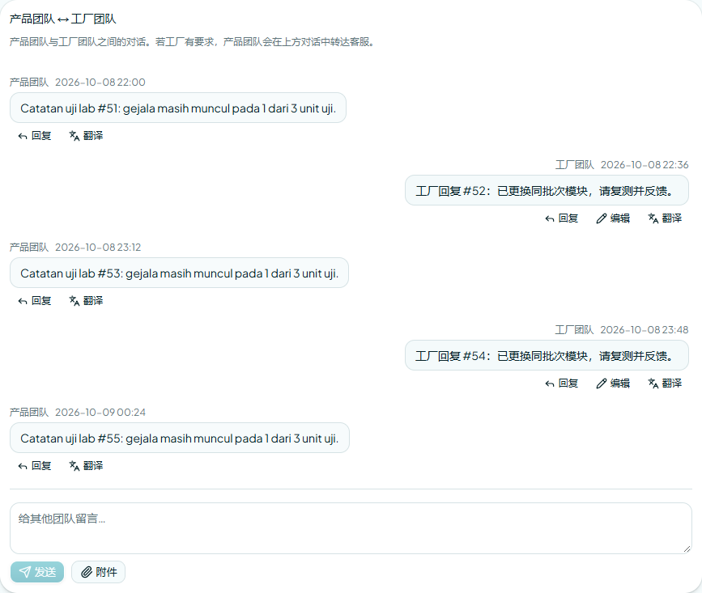
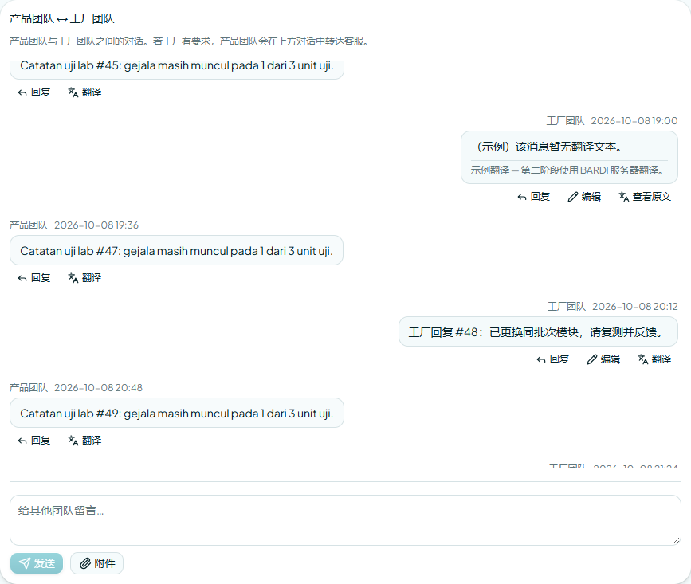

### 7.5 Ticket states

A solved ticket stays visible; the factory can reopen it if the problem comes back
("Reopen" → "The ticket goes back to the Product Team for follow-up").

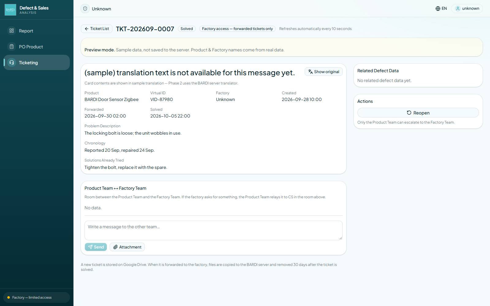
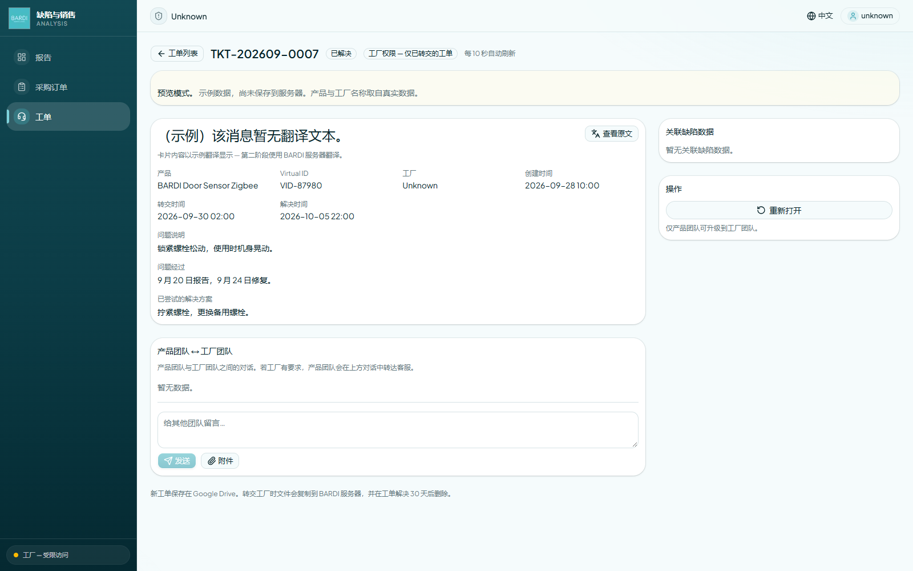

---

## 8. Cross-cutting requirements

1. **Language** — interface in English or 中文; the choice is remembered per browser.
   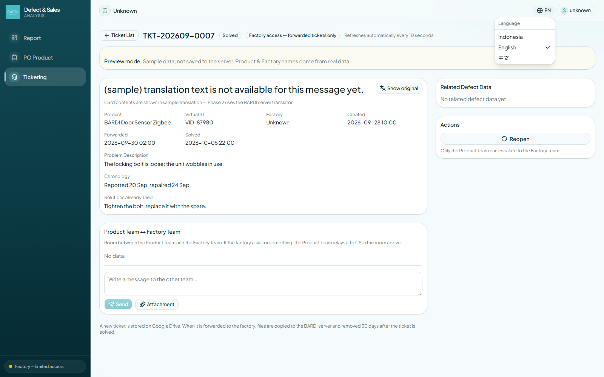
   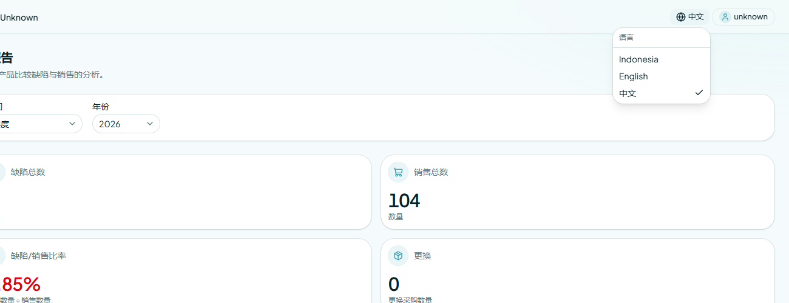
2. **No dependency on Google at runtime** — the factory network blocks Google domains, so the app must
   never load fonts, scripts, or images from Google/CDN. Ticket files that the factory must open are
   copied to the BARDI server when a ticket is escalated (`PRODUCT.md:57-58`).
3. **Privacy** — factory payloads never contain IDR values, internal pricing, or CS conversations.
4. **Retention** — server copies of ticket files live 30 days after the ticket is solved, then they are
   cleaned up automatically.
5. **Freshness** — the ticket detail page polls every 10 seconds; the ticket list flags unread tickets
   with a "New updates" badge.
6. **Performance** — long conversations render 10 bubbles at a time and load more on demand.

## 9. Screenshot index

| File | Content |
| --- | --- |
| `en-01` / `zh-01` | Sidebar (3 menus) + Report overview |
| `en-02` / `zh-02` | Report, full page |
| `en-03` / `zh-03` | Report — Recap by Product table |
| `en-04` / `zh-04` | Report — product detail popup |
| `en-05` / `zh-05` | PO Product |
| `en-06` / `zh-06` | Ticket list (factory view) |
| `en-07` / `zh-07` | Ticket detail (factory view) |
| `en-08` / `zh-08` | Ticket detail, full page |
| `en-09` / `zh-09` | Product Team ↔ Factory Team room |
| `en-10` / `zh-10` | Bubble actions on hover (Reply / Edit / Translate) |
| `en-11` / `zh-11` | Translated message inside the room |
| `en-12` / `zh-12` | Solved ticket (Reopen) |
| `en-13` / `zh-13` | Language switcher |

## 10. Quick start for the Factory Team

1. Open **https://portalbardi.cloud** in Chrome and sign in with the account BARDI gave you.
2. Wrong language? Click the globe icon in the header and pick **English** or **中文**.
3. **Report** → pick the period (Yearly / Monthly / Custom) → read the cards → scroll to *Recap by
   Product* → click a product row to see its defects → click a defect row for the full defect detail.
4. **PO Product** → filter by product, month, or year to see the purchase orders of this factory.
5. **Ticketing** → tickets BARDI escalated to you appear here. Click a row to open the ticket.
6. Inside a ticket: read the problem and attachments, write your answer in the
   **Product Team ↔ Factory Team** room, attach files if needed, and press **Mark as Solved** once done.
7. Need the original wording? Use **Show original** (per message) — the ticket is translated
   automatically for factory accounts.

## 11. Open items

- Ticketing currently shows sample data (preview mode); Phase 1 replaces it with the real
  `tickets` / `ticket_messages` / `ticket_attachments` tables and the Drive → server file copy.
- Phase 2 replaces the sample translation dictionary with the BARDI server translator
  (LibreTranslate, `en,id,zh`) and adds a translation cache.
- Email or push notification for "New updates" is not implemented; the badge and the 10-second
  refresh are the current signal.
