# Factory Guide & Feature List — BARDI Portal

| | |
| --- | --- |
| What this is | A plain-language guide to the pages a factory account can use in the BARDI portal |
| Version | 2.1 |
| Who it is for | The factory team in China, and anyone helping them get started |
| Language | Interface available in English and 中文 (Chinese) |

---

## 1. What the portal gives you

The BARDI portal lets the factory see, in one place and by itself:

- how many units of the factory's products came back as defects, and how many were sold,
- how the two compare (the defect ratio), over any period you choose,
- which purchase orders BARDI placed for the factory's products.

You no longer need to ask the BARDI Product Team for these numbers — you can look them up whenever
you want.

## 2. Signing in

1. Open **https://portalbardi.cloud** in Chrome.
2. Type the username and password BARDI gave you, then sign in.
3. The first page you land on is **Report**.

Your account is tied to your own factory. Everything you see — products, quantities, purchase orders —
belongs to your factory only. Another factory's numbers never appear on your pages.

Prefer Chinese? Click the globe icon in the top-right corner and choose **中文**. Your choice is
remembered the next time you sign in.

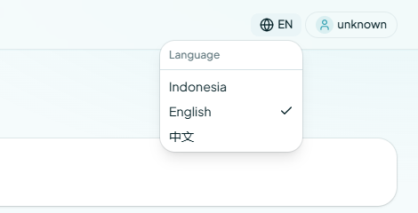
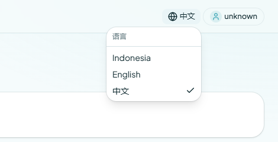

## 3. The two pages in this guide

- **Report** — defect and sales analysis for your products.
- **PO Product** — the purchase orders BARDI placed for your products.

You open them from the menu on the left side of the screen. Whatever page you are on, the portal only
ever shows your own factory's information — nothing from another factory appears here.

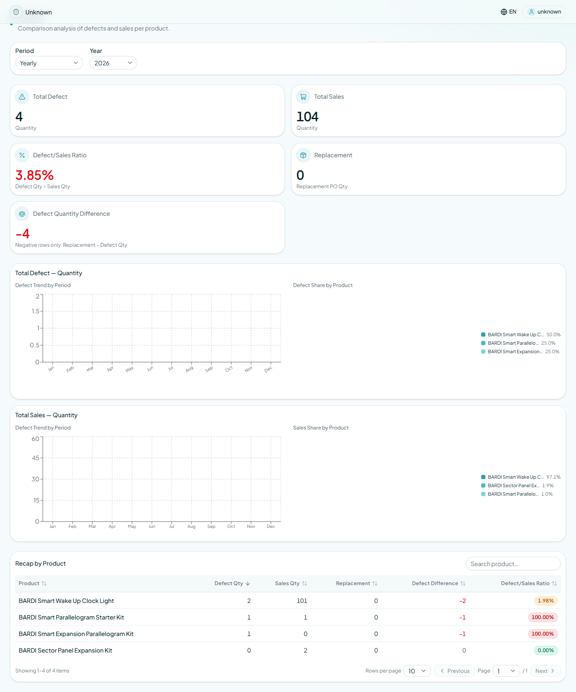
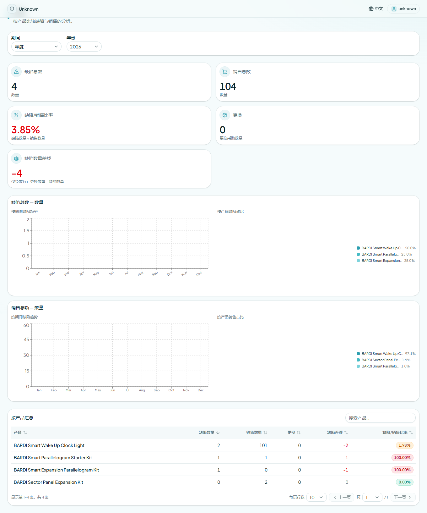

---

## 4. Report

This is the page to open when you want to know how your products are doing.

### 4.1 Choose the period

At the top you pick the period you want to look at:

- **Daily**, **Weekly**, **Monthly**, **Yearly**, or **Custom** (your own start and end date).
- Then choose the month and the year you are interested in.

Every card, chart, and table below follows that choice. The page starts on **Yearly** for the current
year.

### 4.2 The summary cards

Five cards give you the headline numbers:

| Card | What it tells you |
| --- | --- |
| **Total Defect — Quantity** | How many units came back as defects in the period |
| **Total Sales — Quantity** | How many units were sold in the period |
| **Defect/Sales Ratio** | Defects compared with sales, in percent |
| **Replacement — Replacement PO Qty** | Units replaced under a Replacement purchase order |
| **Defect Quantity Difference** | Replacement units minus defect units (negative rows only) |

Each card has a small line under the number explaining how it is counted.

### 4.3 The charts

Two pairs of charts show the same numbers visually:

- **Total Defect — Quantity**: how defects move over the months, plus a share-per-product pie.
- **Total Sales — Quantity**: how sales move over the months, plus a share-per-product pie.

Hover a bar or a slice to see the exact number.

### 4.4 Recap by Product

The table at the bottom lists your products one row at a time: **Product, Defect Qty, Sales Qty,
Replacement, Defect Difference, Ratio**. Click any column title to sort, type in the search box to find
one product quickly, and use the page numbers if you have many products.

Two clicks take you from the table to one single defect.

**Step 1 — click a product row.** A pop-up opens with the defect list of that product for the period: one
row per defect, with the warranty code, date and time, problem, status, and quantity.

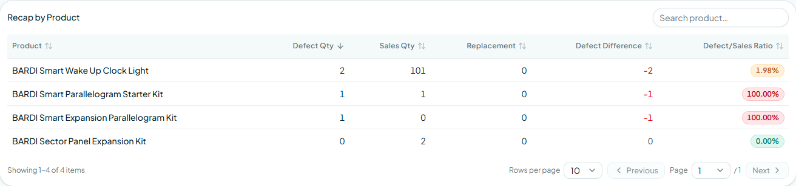
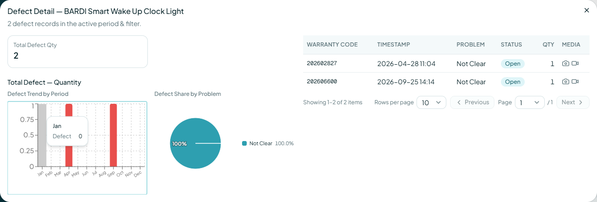

**Step 2 — click a defect row inside that pop-up.** A second pop-up opens with the full detail of that one
defect: **warranty code, timestamp, product, factory, problem, status, quantity**, and the photo or video
attached to it, if there is one — click the **Photo** or **Video** link to open the file in a new tab.

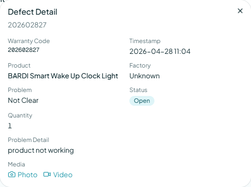

Close the second pop-up with the **X** or the **Esc** key and you are back at the product's defect list —
that table stays open, so you can open the next defect straight away.

The same three screens in Chinese:

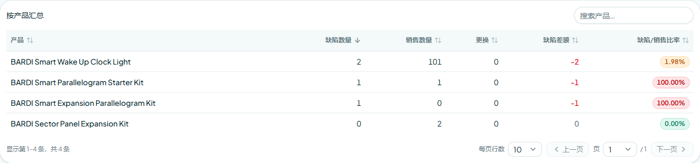
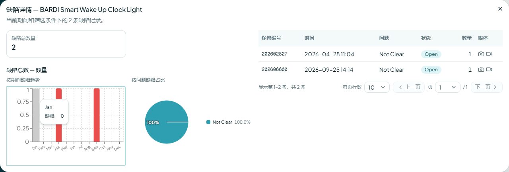
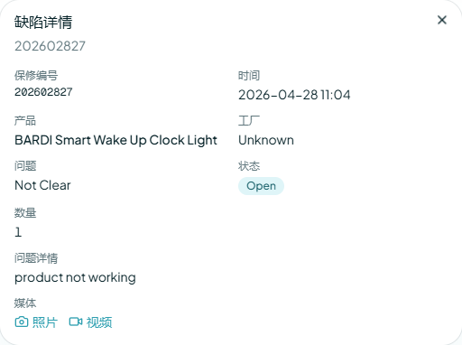

---

## 5. PO Product

This page lists the purchase orders BARDI placed for your products.

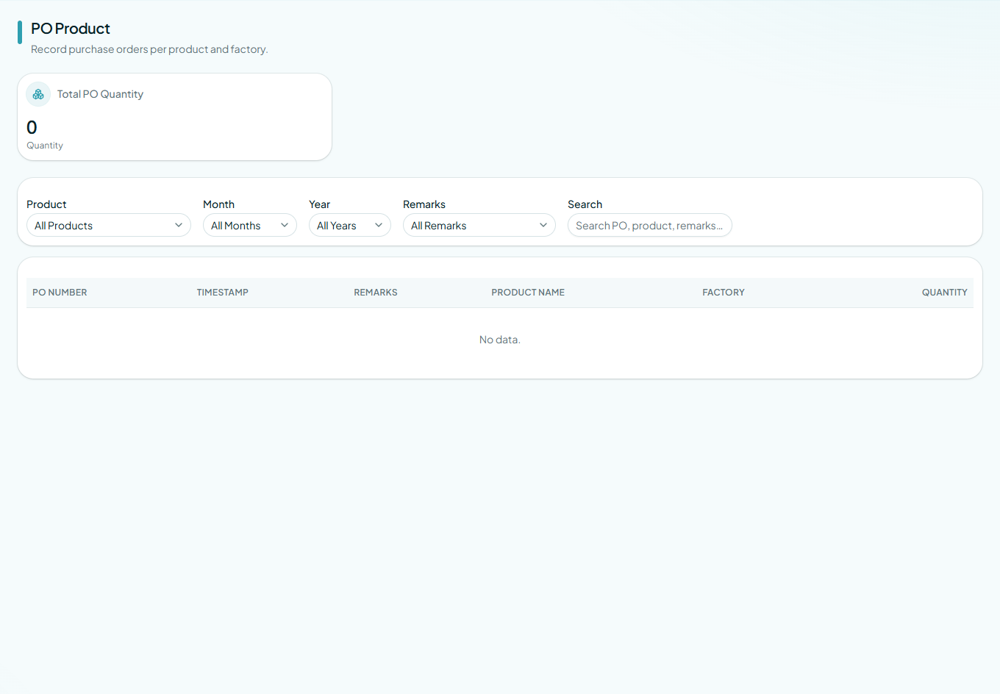

- The table shows six columns: **PO NUMBER, TIMESTAMP, REMARKS, PRODUCT NAME, FACTORY, QUANTITY**.
- Use the filters above the table to narrow it down by product, month, year, or remarks.
- The page is for reading: it simply tells you what was ordered, when, and how many units.

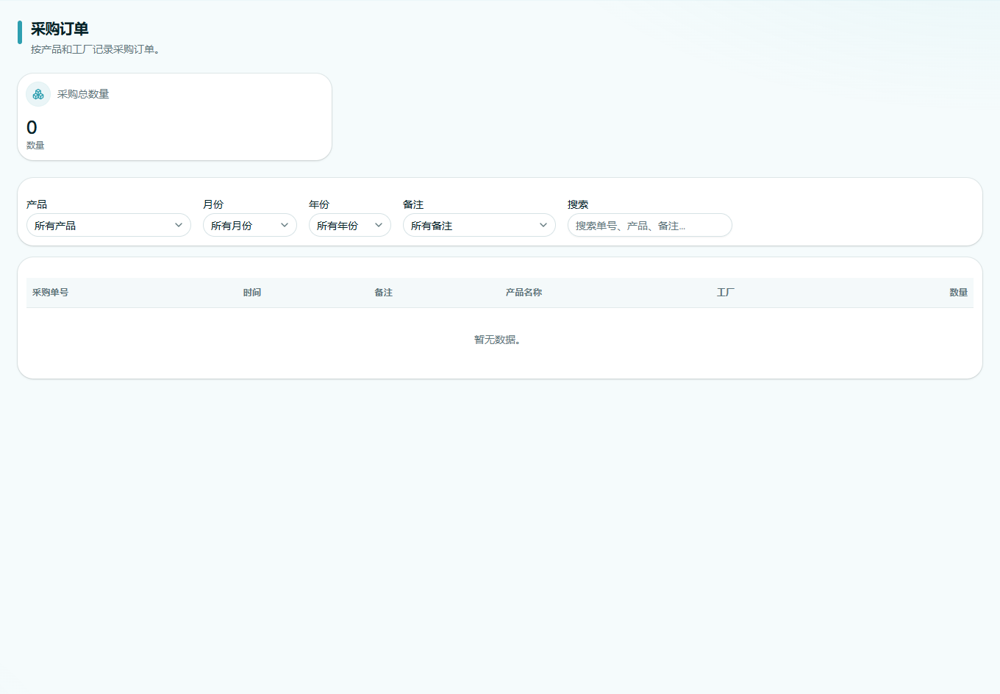

---

## 6. Good to know

- **Your own factory only.** The portal always shows your factory's products and orders; no other
  factory's data is visible to you.
- **Language.** English and 中文, switchable at any time from the globe icon (see the picture in
  section 2).
- **Works on the factory network.** The portal does not need access to Google services to open, so it
  works from the factory's own network.
- **If a page looks empty**, check the period selector first — a month with no sales or no defects shows
  empty cards and charts.

## 7. Quick start

1. Open **https://portalbardi.cloud** and sign in.
2. Not in the right language? Globe icon → **English** or **中文**.
3. Pick the period you care about (Yearly, Monthly, or Custom).
4. Read the five cards for the headline numbers.
5. Scroll to **Recap by Product**, search your product, and click the row.
6. Click a defect row in the pop-up to see the full detail, including photos or videos.
7. Open **PO Product** when you want to check what BARDI ordered for your products.

## 8. Screenshot index

| Picture | Shown in | What it shows |
| --- | --- | --- |
| `01-report-overview-en` / `-zh` | Section 3 | Report — top of the page (period selector and cards) |
| `02-report-full-en` / `-zh` | Section 4 | Report — the full page with cards and charts |
| `03-report-recap-en` / `-zh` | Section 4.4 | Report — the Recap by Product table |
| `04-report-product-popup-en` / `-zh` | Section 4.4 | The product pop-up with its defect list |
| `07-defect-detail-en` / `-zh` | Section 4.4 | The defect detail pop-up that opens from a defect row |
| `05-po-product-en` / `-zh` | Section 5 | PO Product |
| `06-language-switcher-en` / `-zh` | Section 2 | The globe icon and the language choices |
